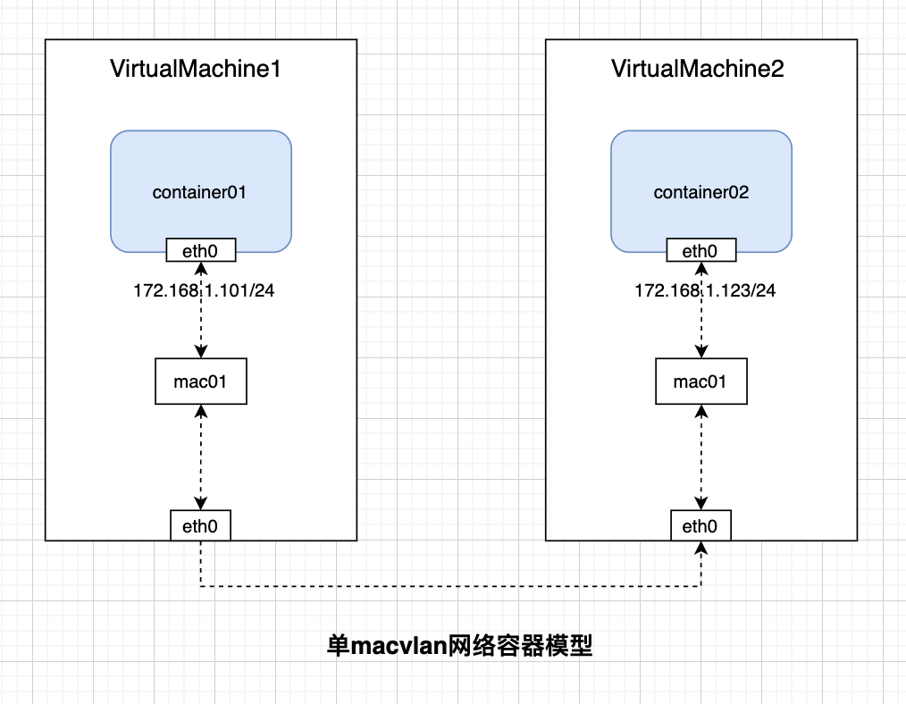
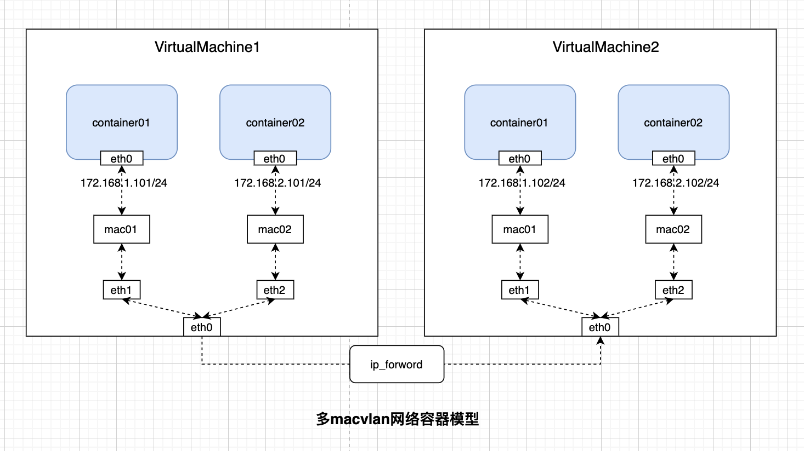

`macvlan`是一种linux虚拟化技术，它是在物理的网卡上虚拟化出多个网卡，可以指定mac地址和ip地址，他可以跟主机在同一个二层平面网络，而且他支持vlan，很好的解决多节点容器网络问题（自己的理解，此时的物理网卡可以看成一个交换机）。他有四种模式，在容器网络中运用最多的是bridge模式（此时的bridge和linux的bridge虚拟不同），在该模式下,容器之间通过物理网卡在一个二层平面网络就可以进行通信，下面就容器网络进行说明：

* 单macvlan容器网络模型：

  

容器中的eth0就是虚拟出来的网卡，有独立的MAC地址和IP地址。

* 多macvlan容器网络模型：

  

两个主机的容器1都在同一个VLAN下，容器2都在一个VLAN。不同的VLAN通信使用路由器来实现。通信原理跟上述中不同VLAN通信相似，只不过在在容器中 路由器是虚拟设备。容器的网卡的网卡的网关都指向虚拟路由器，虚拟路由器通过iptables进行路由转发。