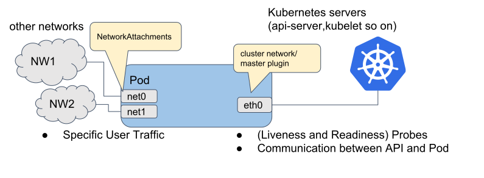

## Multus
Multus 可以给 Pod 添加多张网卡。

master plugin 负责接入 K8s 网络。



Multus 使用 CRDs 扩展 K8s API，来存储 Multus 所需信息，例如除 master plugin 之外网卡的配置信息。

Multus 以 daemonset 的形式存在于节点上。Multus daemonset 做了以下几件事：
- 将 multus binary 放到每个节点的 `/opt/cni/bin` 目录下
- 基于默认网络配置文件 （通常是 `/etc/cni/net.d` 下字典序第一个配置文件） 生成 `/etc/cni/net.d/00-multus.conf`
- 在每个节点上创建 `/etc/cni/net.d/multus.d` 目录，包含 Multus 访问 Kubernetes API 的认证信息。

Multus 定义了一个 CRD: NetworkAttachmentDefinition，通过在创建 Pod 时加上相应的注解来增加指定的网卡。在注解中以逗号分隔，可以指定多个额外的网卡。也可以指定多个相同类型的网卡。
```
metadata:
  name: samplepod
  annotations:
    k8s.v1.cni.cncf.io/networks: foo,macvlan-conf

metadata:
  name: samplepod
  annotations:
    k8s.v1.cni.cncf.io/networks: macvlan-conf,macvlan-conf
```

- Pod 的 Annotation 里有详细的网络配置信息
```
$ kubectl describe pod samplepod
Annotations:        k8s.v1.cni.cncf.io/networks: macvlan-conf
                    k8s.v1.cni.cncf.io/network-status:
                      [{
                          "name": "cbr0",
                          "ips": [
                              "10.244.1.73"
                          ],
                          "default": true,
                          "dns": {}
                      },{
                          "name": "macvlan-conf",
                          "interface": "net1",
                          "ips": [
                              "192.168.1.205"
                          ],
                          "mac": "86:1d:96:ff:55:0d",
                          "dns": {}
                      }]

```


### 配置
- daemonset 
  - `git clone https://github.com/k8snetworkplumbingwg/multus-cni.git && cd multus-cni`
  - `cat ./images/multus-daemonset.yml | kubectl apply -f -`
- 定义附加网卡。 **注意**: config 中 master 字段需要和主机上默认路由的网卡相同
```
$ cat <<EOF | kubectl create -f -
apiVersion: "k8s.cni.cncf.io/v1"
kind: NetworkAttachmentDefinition
metadata:
  name: macvlan-conf
spec:
  config: '{
      "cniVersion": "0.4.0",
      "type": "macvlan",
      "master": "enp0s5",
      "mode": "bridge",
      "ipam": {
        "type": "whereabouts",
        "range": "10.211.55.0/24",
        "range_start": "10.211.55.21",
        "gateway": "10.211.55.1"
      }
    }'
EOF

$ kubectl get network-attachment-definitions
NAME           AGE
macvlan-conf   15s
```
- 创建 Pod

```
$ cat <<EOF | kubectl create -f -
apiVersion: apps/v1
kind: Deployment
metadata:
  name: http-server-deployment
  labels:
    app: http-server
spec:
  replicas: 2
  selector:
    matchLabels:
      app: http-server
  template:
    metadata:
      labels:
        app: http-server
      annotations:
        k8s.v1.cni.cncf.io/networks: macvlan-conf
    spec:
      containers:
      - name: http-test
        image: registry.cn-hangzhou.aliyuncs.com/ericwvi/http-test
        ports:
        - containerPort: 8080
---
apiVersion: v1
kind: Service
metadata:
  name: http-server
spec:
  type: NodePort
  selector:
    app: http-server
  ports:
    - protocol: TCP
      port: 8080
      targetPort: 8080
      nodePort: 30036
EOF
```