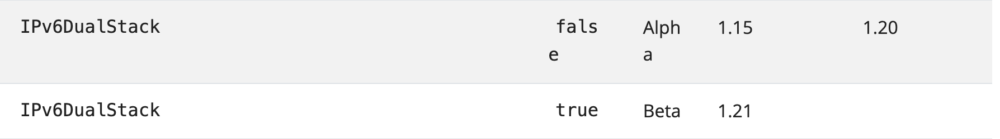

## Dual Stack
> [IPv6](../../Computer%20Network/Protocol/network/IPv6.md)

### Goals
- 支持 Pod 之间的 IPv4 或 IPv6 通信
- 支持 Pod 使用 IPv4 或者 IPv6 访问集群外部
- Ingress Controller 支持 IPv4 或 IPv6 的外部访问
- 为 ClusterIP，NodePort，ExternalIP 类型的 Service 提供双栈支持

### Non-Goals
- IPv4 与 IPv6 之间的通信不在考虑范围之内（Ingress Controller 或许可以将流量负载均衡至同一个 EndPoint的 IPv4 或 IPv6 地址）

### Proposal
- Service Cluster IP Range 配置 `--service-cluster-ip-range=<IPv4 CIDR>,<IPv6 CIDR>`。如果 Service Spec 里面没有指定 IP family，就从第一个 CIDR 中分配 IP。
- Endpoint 的地址族和 Service 的第一个地址族相同，例如一个 IPv6 的 Service 只会有 IPv6 的 Endpoint。
- EndpointSlices 支持双栈 endpoints。

### Pod 多 IP 的感知
- 扩展 Pod Status

### 环境搭建(二进制方式搭建)

1. ### kubernetes 开启 DualStack feature GA

   在kubernetes中，双栈feature GA 特性是在1.15成为Alpha(默认关闭，可使用--feature-gates=IPv6DualStack=true开启).

   在1.20，该特性由Alpha变为Beta,意味着该特性已经稳定，默认开启，但可手动关闭. 
   [详情](https://kubernetes.io/zh/docs/reference/command-line-tools-reference/feature-gates/)

  
   
   - 如果你的kubernetes版本 < 1.15，则无法使用双栈特性。

   - 如果你的kubernetes版本在[1.15,1.20]之间,则需要通过--feature-gates=IPv6DualStack=true 开启。

   - 如果你的kubernetes版本 > 1.20, 无需额外操作，默认开启。
   
   
2. ### **DualStack双栈环境 搭建**

#### **a.宿主机配置IPv6，以centos为例(每个节点都需要操作)**：

    
加载ipv6内核模块：

    vim /etc/modprobe.d/disable_ipv6.conf

    options ipv6 disable=0

启用ipv6网络：

    vim /etc/sysconfig/network

    NETWORKING_IPV6=yes

sysctl参数启用ipv6：

    vim /etc/sysctl.conf
    net.ipv6.conf.all.disable_ipv6 = 0
    net.ipv6.conf.default.disable_ipv6 = 0
    net.ipv6.conf.lo.disable_ipv6 = 0
    net.ipv6.conf.all.forwarding=1

    sysctl -p  

加载IPv6内核模块：

    lsmod | grep ipv6 

    # 如果输出没有内容，重新加载
    
    modprobe ipv6

重启网络服务：

    service restart network           #centos7
    systemctl restart NetworkManager  #centos8

配置IPv6地址：
    
    ip -6 addr add  2001:250:4000:2000::53/64 dev ens192  # ens192 为网卡名称
    
配置默认路由，需要配置默认路由，不然会导致service之间无法通讯
[issue2758](https://github.com/projectcalico/calico/issues/2758) 
    
    route -A inet6 add default gw 2001:250:4000:2000::1  # 默认网关地址不要求一定可达，但必须和配置的v6地址处于同一网段

IPv6地址连通性测试：

    [root@master ~]# ping  2001:250:4000:2000::57
    PING 2001:250:4000:2000::57(2001:250:4000:2000::57) 56 data bytes
    64 bytes from 2001:250:4000:2000::57: icmp_seq=1 ttl=64 time=0.876 ms
    64 bytes from 2001:250:4000:2000::57: icmp_seq=2 ttl=64 time=0.367 ms
    64 bytes from 2001:250:4000:2000::57: icmp_seq=3 ttl=64 time=0.278 ms
    64 bytes from 2001:250:4000:2000::57: icmp_seq=4 ttl=64 time=0.304 ms

#### **b. kubernetes配置双栈**

kube-apiserver:

    # vim /opt/kubernetes/cfg/kube-apiserver.conf
    --service-cluster-ip-range=10.0.0.0/24,fd00::/108  # 增加service ipv6 cidr
    --feature-gates=IPv6DualStack=true                 # 根据kubernetes版本决定是否配置

kube-controller-manager:
    
    # vim /opt/kubernetes/cfg/kube-controller-manager.conf 
    --cluster-cidr=10.244.0.0/16,fc00::/48             # 增加pod ipv6 cidr,注这个地址须和calico的ipv6 cidr保持一致
    --service-cluster-ip-range=10.0.0.0/24,fd00::/108  # 增加service ipv6 cidr，各组件保持一致
    --node-cidr-mask-size-ipv4=24 
    --node-cidr-mask-size-ipv6=64 
    --feature-gates=IPv6DualStack=true                 # 根据kubernetes版本决定是否配置

kube-proxy:
    
    # vim /opt/kubernetes/cfg/kube-proxy.conf
    --clusterCIDR=10.0.0.0/24,fd00::/108               # 增加service ipv6 cidr，各组件保持一致
    --feature-gates=IPv6DualStack=true                 # 根据kubernetes版本决定是否配置

kubelet:

    # vim /opt/kubernetes/cfg/kubelet.conf
    --feature-gates=IPv6DualStack=true                 # 根据kubernetes版本决定是否配置

重启各个组件：

    systemctl daemon-reload 
    systemctl restart kube-apiserver
    systemctl restart kube-controller-manager
    systemctl restart kube-proxy
    systemctl restart kubelet

#### c. 安装网络插件(calico为例)

下载calico部署文件
    
    curl https://docs.projectcalico.org/manifests/calico.yaml -O

修改配置：
    
    # vim calico.yaml
    # 在kind=configMap,name=calico-config处
    "ipam": {
        "type": "calico-ipam",
        "assign_ipv4": "true",
        "assign_ipv6": "true"
    },

    # 在kind=DaemonSet,name=calico-node: spec.template.spec.containers.env处：
    # 增加环境变量：
    - name: IP
        value: "autodetect"
    - name: IP6
        value: "autodetect"
    - name: CALICO_IPV4POOL_CIDR
        value: "10.244.0.0/16"
    - name: CALICO_IPV6POOL_CIDR
        value: "fc00::/48"
    # Disable IPv6 on Kubernetes.
    - name: FELIX_IPV6SUPPORT
        value: "true"
    - name: FELIX_HEALTHENABLED
        value: "true"
    - name: IP6_AUTODETECTION_METHOD
        value: interface=ens192    # ens192为网卡名称，支持正则匹配
    
部署calico：

    kubectl apply -f calico.yaml

查看结果：
    
    [root@master deploy]# kubectl get po -n kube-system
    NAME                                       READY   STATUS    RESTARTS   AGE
    calico-kube-controllers-659bd7879c-g68c5   1/1     Running   1          25h
    calico-node-grw74                          1/1     Running   1          25h
    calico-node-k7c6h                          1/1     Running   0          25h
    calico-node-ljg5v                          1/1     Running   0          25h
    coredns-6c44b9db5b-8mxjb                   1/1     Running   0          2d

5. ### **验证**

创建deployment,查看是否绑定IPv6地址

    [root@master deploy]# kubectl apply -f deploy.yaml
    [root@master deploy]# kubectl describe po hello1-deployment-d7dbc7d8c-cwfk8
    Name:         hello1-deployment-d7dbc7d8c-cwfk8
    Namespace:    default
    Priority:     0
    Node:         master/10.6.230.1
    Start Time:   Tue, 12 Oct 2021 15:51:37 +0800
    Labels:       app=hello1
    pod-template-hash=d7dbc7d8c
    Annotations:  cni.projectcalico.org/containerID: af3b93376fe0c1efac16aa8d6f5b28b4348414b6768b7d353b6e6faf5bf77fbf
    cni.projectcalico.org/podIP: 10.244.219.68/32
    cni.projectcalico.org/podIPs: 10.244.219.68/32,fc00::db4d:f2f2:402d:3b99:a183/128
    Status:       Running
    IP:           10.244.219.68
    IPs:
    IP:           10.244.219.68
    IP:           fc00::db4d:f2f2:402d:3b99:a183
    .....

pod已分配了IPv6地址，创建service：

    [root@master deploy]# vim hello1.yaml
    apiVersion: v1
    kind: Service
    metadata:
    name: hello1-service
    labels:
    name: hello1-service
    spec:
    ipFamilyPolicy: PreferDualStack  # service 配置双栈地址
    ipFamilies:
    - IPv6  # 类型IPv6
    - IPv4  # 类型IPv6
    type: ClusterIP
    ports:
    - port: 8080
    targetPort: 8080
    protocol: TCP
    selector:
    app: hello1

    [root@master deploy]kubectl apply -f hello1.yaml

查看service
 
    [root@master deploy]kubectl describe svc 
    [root@node2 svc-yaml]# kubectl describe svc hello1-service
    Name:              hello1-service
    Namespace:         default
    Labels:            name=hello1-service
    Annotations:       <none>
    Selector:          app=hello1
    Type:              ClusterIP
    IP Family Policy:  PreferDualStack
    IP Families:       IPv6,IPv4
    IP:                fd00::33a4
    IPs:               fd00::33a4,10.0.0.49
    Port:              <unset>  8080/TCP
    TargetPort:        8080/TCP
    Endpoints:         [fc00::db4d:f2f2:402d:3b99:a183]:8080   # 后端pod地址
    Session Affinity:  None
    Events:            <none>

验证：pod之间、pod访问service clusterVip 都正常通信