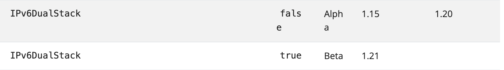

## Dual Stack
> [IPv6](../../Computer%20Network/Protocol/network/IPv6.md)

### Goals
- 支持 Pod 之间的 IPv4 或 IPv6 通信
- 支持 Pod 使用 IPv4 或者 IPv6 访问集群外部
- Ingress Controller 支持 IPv4 或 IPv6 的外部访问
- 为 ClusterIP，NodePort，ExternalIP 类型的 Service 提供双栈支持

### Non-Goals
- IPv4 与 IPv6 之间的通信不在考虑范围之内（Ingress Controller 或许可以将流量负载均衡至同一个 EndPoint 的 IPv4 或 IPv6 地址）


### Behavior
#### Service
- Service Cluster IP Range 配置 `--service-cluster-ip-range=<IPv4 or IPv6 CIDR>,<IPv4 or IPv6 CIDR>`。
- Service `.spec.iPFamilyPolicy`
  - `SingleStack`: 作为默认值。从第一个 CIDR 中分配 IP。
  - `PreferDualStack`: 双栈集群上为双栈 `iPFamilies`，行为与 `RequireDualStack` 一致。单栈集群上为单栈 `iPFamilies`，行为与 `SingleStack` 一致。
  - `RequireDualStack`: 给 Service `ClusterIPs` 分配 IPv4 地址和 IPv6 地址，与 `iPFamilies` 第一个元素对应的地址作为 `ClusterIP`。需要集群支持双栈，否则报错。
- Service `.spec.iPFamilies`
  - ["IPv4"]
  - ["IPv6"]
  - ["IPv4","IPv6"] (dual stack)
  - ["IPv6","IPv4"] (dual stack)
- 如果 Service Spec 里面没有指定 IP family，就从第一个 CIDR 中分配 IP。
- Service 一旦创建之后就不可以更改 iPFamilies，因为对于已存在的 Service，不允许更改 ClusterIP。


#### Endpoint
- Endpoint 的地址族和 Service 的第一个地址族相同，例如一个 ClusterIP 属于 IPv6 的 Service 只会有 IPv6 的 Endpoint。
- EndpointSlices 字段 `addressType` 表明了所属地址族，`IPv6` 或者 `IPv4`。kube-proxy 根据 EndpointSlices 工作。


#### DNS
CoreDNS 会读取 EndpointSlices，为 IPv4 产生 A 记录，为 IPv6 产生 AAAA 记录。

对于单栈的服务，DNS 运行方式和以往相同。对于双栈服务，默认返回 Service 的 IPv4 地址和 IPv6 地址。指定 A 记录类型时，返回 IPv4 地址；指定 AAAA 记录类型时，返回 IPv6 地址。

Pod 的 `/etc/resolv.conf` 中域名服务器地址取决于集群 Service 的第一个 CIDR 段的地址族。

对于无头服务，CoreDNS 会同时返回 Pod 的 IPv4 地址和 IPv6 地址。


## 环境搭建
### kubeadm 方式
#### control plane
- `kubeadm init --config=kubeadm-config.yaml`

```yaml
---
apiVersion: kubeadm.k8s.io/v1beta3
kind: ClusterConfiguration
featureGates:
  IPv6DualStack: true
networking:
  podSubnet: 2001:db8:42:0::/56,10.244.0.0/16
  serviceSubnet: 2001:db8:42:1::/112,10.96.0.0/16
---
apiVersion: kubeadm.k8s.io/v1beta3
kind: InitConfiguration
localAPIEndpoint:
  advertiseAddress: "fdb2:2c26:f4e4::11"
  bindPort: 6443
nodeRegistration:
  kubeletExtraArgs:
    node-ip: fdb2:2c26:f4e4::11,10.211.55.11
```

#### worker node
- `kubeadm join --config=kubeadm-config.yaml`

```yaml
apiVersion: kubeadm.k8s.io/v1beta3
kind: JoinConfiguration
discovery:
  bootstrapToken:
    apiServerEndpoint: "[fdb2:2c26:f4e4::11]:6443"
    token: "clvldh.vjjwg16ucnhp94qr"
    caCertHashes:
    - "sha256:a4863cde706cfc580a439f842cc65d5ef112b7b2be31628513a9881cf0d9fe0"
nodeRegistration:
  kubeletExtraArgs:
    node-ip: fdb2:2c26:f4e4::12,10.211.55.12
```

#### 网络插件
- 网络插件以 Calico 为例
- 修改 ConfigMap `calico-config`

```
    "ipam": {
        "type": "calico-ipam",
        "assign_ipv4": "true",
        "assign_ipv6": "true"
    },
```

- 容器 calico-node 环境变量加入

```
- name: IP6
  value: "autodetect"
- name: FELIX_IPV6SUPPORT
  value: "true"
```


### 二进制方式
#### Kubernetes 开启 DualStack feature gate
在kubernetes中，双栈 feature gate 特性是在 1.15 成为 Alpha (默认关闭，可使用 --feature-gates=IPv6DualStack=true 开启)。

在 1.20，该特性由 Alpha 变为 Beta，意味着该特性已经稳定，默认开启，但可手动关闭， 可见 [详情](https://kubernetes.io/zh/docs/reference/command-line-tools-reference/feature-gates/) 。


   
- 如果你的kubernetes版本 < 1.15，则无法使用双栈特性。
- 如果你的kubernetes版本在 [1.15,1.20] 之间,则需要通过 --feature-gates=IPv6DualStack=true 开启。
- 如果你的kubernetes版本 > 1.20, 无需额外操作，默认开启。


#### DualStack 双栈环境搭建
宿主机配置 IPv6，以 CentOS 为例(每个节点都需要操作)
1. 加载 ipv6 内核模块：

```
vim /etc/modprobe.d/disable_ipv6.conf
options ipv6 disable=0
```

2. 启用 ipv6 网络：

```
vim /etc/sysconfig/network
NETWORKING_IPV6=yes
```
3. sysctl 参数启用 ipv6：

```
vim /etc/sysctl.conf
net.ipv6.conf.all.disable_ipv6 = 0
net.ipv6.conf.default.disable_ipv6 = 0
net.ipv6.conf.lo.disable_ipv6 = 0
net.ipv6.conf.all.forwarding=1

sysctl -p  
```

4. 加载IPv6内核模块：

```
lsmod | grep ipv6 
# 如果输出没有内容，重新加载
modprobe ipv6
```

5. 重启网络服务：

```
service restart network           #centos7
systemctl restart NetworkManager  #centos8
```

6. 配置IPv6地址：

```    
ip -6 addr add  2001:250:4000:2000::53/64 dev ens192  # ens192 为网卡名称
```
    
7. 宿主机访问 Service 需要配置默认路由

```    
route -A inet6 add default gw 2001:250:4000:2000::1  # 默认网关地址不要求一定可达，但必须和配置的 IPv6 地址处于同一网段
```


#### Kubernetes 配置双栈
1. kube-apiserver:

```
# vim /opt/kubernetes/cfg/kube-apiserver.conf
--service-cluster-ip-range=10.0.0.0/24,fd00::/108  # 增加 Service IPv6 CIDR
--feature-gates=IPv6DualStack=true                 # 根据 Kubernetes 版本决定是否配置
```

2. kube-controller-manager:
    
```
# vim /opt/kubernetes/cfg/kube-controller-manager.conf 
--cluster-cidr=10.244.0.0/16,fc00::/48             # 增加 pod IPv6 CIDR，注意这个地址须和 calico 的 ipv6 cidr 保持一致
--service-cluster-ip-range=10.0.0.0/24,fd00::/108  # 增加 service IPv6 CIDR，各组件保持一致
--node-cidr-mask-size-ipv4=24 
--node-cidr-mask-size-ipv6=64 
--feature-gates=IPv6DualStack=true                 # 根据 Kubernetes 版本决定是否配置
```

3. kube-proxy:
    
```
# vim /opt/kubernetes/cfg/kube-proxy.conf
--clusterCIDR=10.0.0.0/24,fd00::/108               # 增加 Service IPv6 CIDR，各组件保持一致
--feature-gates=IPv6DualStack=true                 # 根据 Kubernetes 版本决定是否配置
```

4. kubelet:

```
# vim /opt/kubernetes/cfg/kubelet.conf
--feature-gates=IPv6DualStack=true                 # 根据 Kubernetes 版本决定是否配置
```

5. 重启各个组件：

```
systemctl daemon-reload 
systemctl restart kube-apiserver
systemctl restart kube-controller-manager
systemctl restart kube-proxy
systemctl restart kubelet
```


#### 安装网络插件(calico为例)
1. 下载calico部署文件: `curl https://docs.projectcalico.org/manifests/calico.yaml -O`

2. 修改配置：

``` 
# vim calico.yaml
# 在 kind=configMap,name=calico-config 处
"ipam": {
    "type": "calico-ipam",
    "assign_ipv4": "true",
    "assign_ipv6": "true"
},

# 在 kind=DaemonSet,name=calico-node: spec.template.spec.containers.env 处：
# 增加环境变量：
- name: IP
    value: "autodetect"
- name: IP6
    value: "autodetect"
- name: CALICO_IPV4POOL_CIDR
    value: "10.244.0.0/16"
- name: CALICO_IPV6POOL_CIDR
    value: "fc00::/48"
# Disable IPv6 on Kubernetes.
- name: FELIX_IPV6SUPPORT
    value: "true"
- name: FELIX_HEALTHENABLED
    value: "true"
- name: IP6_AUTODETECTION_METHOD
    value: interface=ens192    # ens192为网卡名称，支持正则匹配
```

3. 部署calico： `kubectl apply -f calico.yaml`。

#### 验证

1. 创建 Deployment,查看是否绑定 IPv6 地址

```
[root@master deploy]# kubectl apply -f deploy.yaml
[root@master deploy]# kubectl describe po hello1-deployment-d7dbc7d8c-cwfk8
Name:         hello1-deployment-d7dbc7d8c-cwfk8
Namespace:    default
Priority:     0
Node:         master/10.6.230.1
Start Time:   Tue, 12 Oct 2021 15:51:37 +0800
Labels:       app=hello1
pod-template-hash=d7dbc7d8c
Annotations:  cni.projectcalico.org/containerID: af3b93376fe0c1efac16aa8d6f5b28b4348414b6768b7d353b6e6faf5bf77fbf
cni.projectcalico.org/podIP: 10.244.219.68/32
cni.projectcalico.org/podIPs: 10.244.219.68/32,fc00::db4d:f2f2:402d:3b99:a183/128
Status:       Running
IP:           10.244.219.68
IPs:
IP:           10.244.219.68
IP:           fc00::db4d:f2f2:402d:3b99:a183
.....
```

2. Pod 已分配了 IPv6 地址，创建 Service：

```
[root@master deploy]# vim hello1.yaml
apiVersion: v1
kind: Service
metadata:
  name: hello1-service
  labels:
    name: hello1-service
spec:
  ipFamilyPolicy: PreferDualStack  # Service 配置双栈地址
  ipFamilies:
  - IPv6  # 类型IPv6
  - IPv4  # 类型IPv6
  type: ClusterIP
  ports:
  - port: 8080
    targetPort: 8080
    protocol: TCP
  selector:
    app: hello1

[root@master deploy]kubectl apply -f hello1.yaml
```

3. 查看service
 
```
[root@master deploy]kubectl describe svc 
[root@node2 svc-yaml]# kubectl describe svc hello1-service
Name:              hello1-service
Namespace:         default
Labels:            name=hello1-service
Annotations:       <none>
Selector:          app=hello1
Type:              ClusterIP
IP Family Policy:  PreferDualStack
IP Families:       IPv6,IPv4
IP:                fd00::33a4
IPs:               fd00::33a4,10.0.0.49
Port:              <unset>  8080/TCP
TargetPort:        8080/TCP
Endpoints:         [fc00::db4d:f2f2:402d:3b99:a183]:8080   # 后端 Pod 地址
Session Affinity:  None
Events:            <none>
```
