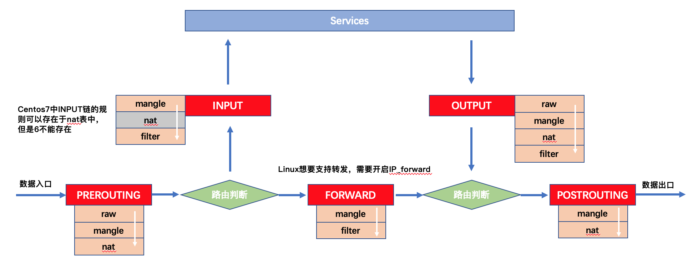
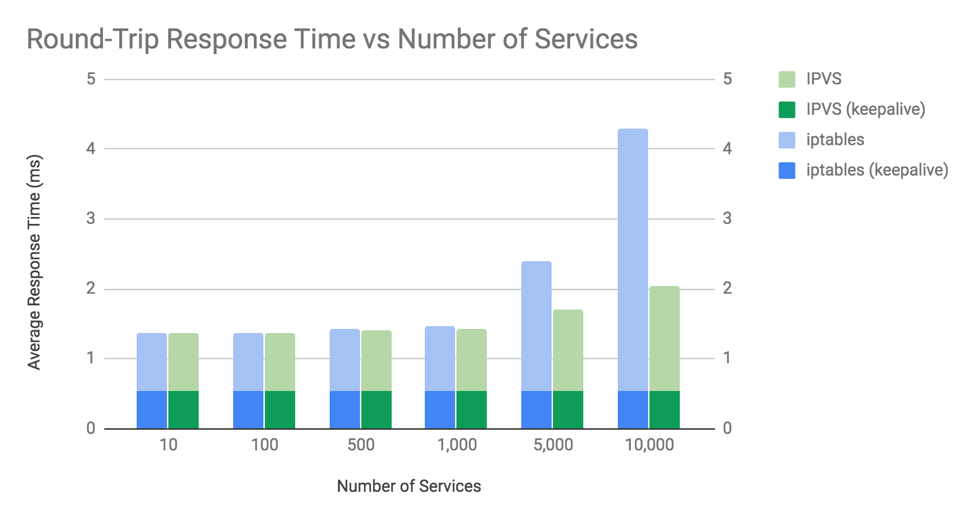
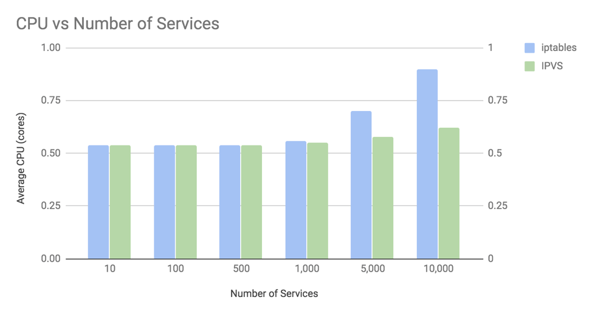

# Iptables vs Ipvs in Kubernetes


## 什么是kube-proxy
`kube-proxy`是Kubernetes的核心组件，部署在每个Node节点上。它是实现kubernetes service
的通信与负载均衡机制的重要组件。`kube-proxy`从`kube-apiserver`获取`Service`信息，并根据`Service`信息创建代理服务，实现`Service`到`Pod`的请求路由和转发。

我们知道Kubernetes Pod只具备临时的生命周期，Pod随时可能被重启、飘逸等。一旦Pod变化，则该Pod提供的服务也就无法访问。所以不能通过使用Pod地址作为服务暴露端口。Kubernetes通过Service和VIP来实现后端真实服务的负载均衡、自动转发等。当`Service`创建时，`kube-proxy`会为这个`Service`生成一系列的规则，这些规则会关联后端真实服务，当访问`Service`时，请求根据这些规则映射到后端的真实服务。

`kube-proxy`支持三种代理模式来生成这些规则：user-space(因为性能问题，已经废弃)、iptables、ipvs


## netfilter

netfilter是linux内核中的一个数据包处理框架。当网卡接收到数据包，就会交给内核。由内核中的netfilter框架对数据包进行过滤、
SNAT、DNAT等操作。 netfilter在内核协议栈中实现了五个hook点，也就是常说的五链。通过一些工具(iptables)可以像这些hook点注册处理函数，也就是常说的规则。当数据包到达这些hook点时，注册在hook点上的处理函数就会被依次执行。


四表：包括raw、mangele、nat、filter。优先级raw > mangele > nat > filter。
- raw
  优先级最高，当设置raw时一般是不再让iptables做数据包的链接追踪，这样可以提高性能
- mangle
  对特定数据包进行修改
- nat
  端口、地址映射，包括DNAT、SNAT
- filter
  对数据包进行过滤


五链：linux kernel定义了五个hook点([源码链接](https://github.com/torvalds/linux/blob/5bfc75d92efd494db37f5c4c173d3639d4772966/include/uapi/linux/netfilter.h)）
```
// include/linux/netfilter.h
enum nf_inet_hooks {
	NF_INET_PRE_ROUTING,
	NF_INET_LOCAL_IN,  #INPUT
	NF_INET_FORWARD,
	NF_INET_LOCAL_OUT,  #OUTPUT
	NF_INET_POST_ROUTING,
};
```

netfilter框架的workflow:

数据包首先到达PREROUTING链，根据表的优先级，按照优先级依次执行raw、mangle、nat上的规则。到达路由判决点，判断数据包的目的地是本机进程。如果目标是本机进程，那么流量包将会被送往INPUT链，执行其链上的

处理流程如下：

- 数据包到达某个网口，比如说ens192，将数据包丢给内核进行处理。
- 进入到raw表的PREROUTING链，raw表可以对收到的数据包在连接追踪前进行处理。一旦用户使用了raw表，那么在该链上raw表处理完之后，将跳过nat表和ip_conntrack处理，即不再做地址转换和数据包的链接追踪处理了。raw一般应用于那些不需要做nat的情况下，以提高性能。
- 进入到mangle的PREROUTING链，在这里可以对数据包进行修改，比如TOS等。
- 进入到nat表的PREROUTING链，在这里可以做DNAT。
- 路由判决，决定数据包是交给本地主机进程还是转发给其他主机。


如果是交给本地主机进程：
- 进入到mangle表的INPUT链，这里是在路由之后但在交由主机进程之前，仍然可以对数据包做一些修改
- 进入到filter的INPUT链，在这里我们可以对流入的所有数据包进行过滤
- 交给本地主机进程进行处理
- 进入到raw、mangle表的OUTPUT链
- 进入到nat表的OUTPUT链，这里一般是对数据包做DNAT处理
- 再次路由判决
- 进入到mangle的POSTROUTING, 可以对数据包进行修改
- 进入到nat表的POSTROUTING链，这一步一般是做SNAT
- 数据包流出内核，交给网络接口

如果是转发给其他主机：
- 进入到mangle表的FORWARD链，对数据包进行某些修改
- 进入到filter表的FORWARD链，对转发的所有数据包进行过滤
- 进入到mangle表的POSTROUTING链，在这里还可以对数据包进行修改
- 进入到nat表的POSTROUTING链，在这里一般是做SNAT
- 数据包从内核流出，进入到网络接口中


在kubernetes中，kube-proxy只修改了filter和nat表，它对iptables的链进行了扩充。自定义了KUBE_SERVICES、KUBE—NODEPORTS、KUBE-POSTROUTING、KUBE-MARK-MASQ和KUBE-MARK-DROP这五个链。主要是在KUBE-SERVICES链(附着在PREROUTING和OUTPUT)增加一些规则。

## Iptables

Iptables是一个用户态的程序，它被允许通过配置链和规则的方式来配置构建与netfilter之上的linux内核防火墙。

我们通过创建一个ClusterIP类型的service来看看`kube-proxy iptables`模式实现原理

```
[root@k8s-master01 ~]# kubectl get svc -A -l name=hello1-service
NAMESPACE   NAME             TYPE        CLUSTER-IP       EXTERNAL-IP   PORT(S)    AGE
cyclinder   hello1-service   ClusterIP   10.108.221.226   <none>        8080/TCP   34m
```

我们创建一个名为`hello1-service`的service，IP为`10.108.221.226`

该service下有三个`endpoint`:
```
[root@k8s-master01 ~]# kubectl get ep hello1-service  -n cyclinder
NAME             ENDPOINTS                                            AGE
hello1-service   10.244.1.38:8080,10.244.1.39:8080,10.244.2.48:8080   55m
```

我们现在在master节点访问这个该service服务，看看数据包流向：

```
curl -i http://10.244.1.38:8080/test
```

首先流量到达的是OUTPUT链：
```
Chain OUTPUT (policy ACCEPT 143 packets, 8580 bytes)
 pkts bytes target     prot opt in     out     source               destination
 293K   18M KUBE-SERVICES  all  --  *      *       0.0.0.0/0            0.0.0.0/0            /* kubernetes service portals */
 218K   13M DOCKER     all  --  *      *       0.0.0.0/0           !127.0.0.0/8          ADDRTYPE match dst-type LOCAL
```

`-j KUBE-SERVICES` 表示会跳转到`KUBE-SERVICES`这条链上：
```
[root@k8s-master01 ~]# iptables -vnL KUBE-SERVICES -t nat
Chain KUBE-SERVICES (2 references)
 pkts bytes target     prot opt in     out     source               destination
    0     0 KUBE-SVC-NPX46M4PTMTKRN6Y  tcp  --  *      *       0.0.0.0/0            10.96.0.1            /* default/kubernetes:https cluster IP */ tcp dpt:443
    0     0 KUBE-SVC-2V5PDE3Q62WJ3RNU  tcp  --  *      *       0.0.0.0/0            10.108.221.226       /* cyclinder/hello1-service cluster IP */ tcp dpt:8080
    0     0 KUBE-SVC-JD5MR3NA4I4DYORP  tcp  --  *      *       0.0.0.0/0            10.96.0.10           /* kube-system/kube-dns:metrics cluster IP */ tcp dpt:9153
    0     0 KUBE-SVC-TCOU7JCQXEZGVUNU  udp  --  *      *       0.0.0.0/0            10.96.0.10           /* kube-system/kube-dns:dns cluster IP */ udp dpt:53
    0     0 KUBE-SVC-ERIFXISQEP7F7OF4  tcp  --  *      *       0.0.0.0/0            10.96.0.10           /* kube-system/kube-dns:dns-tcp cluster IP */ tcp dpt:53
  360 21600 KUBE-NODEPORTS  all  --  *      *       0.0.0.0/0            0.0.0.0/0            /* kubernetes service nodeports; NOTE: this must be the last rule in this chain */ ADDRTYPE match dst-type LOCAL
```

destination为`10.108.221.226`，会跳转到`KUBE-SVC-2V5PDE3Q62WJ3RNU`链：
```
[root@k8s-master01 ~]# iptables -vnL KUBE-SVC-2V5PDE3Q62WJ3RNU -t nat
Chain KUBE-SVC-2V5PDE3Q62WJ3RNU (1 references)
 pkts bytes target     prot opt in     out     source               destination
    0     0 KUBE-MARK-MASQ  tcp  --  *      *      !10.244.0.0/16        10.108.221.226       /* cyclinder/hello1-service cluster IP */ tcp dpt:8080
    0     0 KUBE-SEP-YENGSOSF6TP2X7WS  all  --  *      *       0.0.0.0/0            0.0.0.0/0            /* cyclinder/hello1-service */ statistic mode random probability 0.33333333349
    0     0 KUBE-SEP-72L7BBRMXEG5VF7W  all  --  *      *       0.0.0.0/0            0.0.0.0/0            /* cyclinder/hello1-service */ statistic mode random probability 0.50000000000
    0     0 KUBE-SEP-IA4L7KGKOCPR4FES  all  --  *      *       0.0.0.0/0            0.0.0.0/0            /* cyclinder/hello1-service */
```

发现有四条规则,重点看后面三条：
- 第一条对于源IP不是`10.244.0.0/16`且目标IP是10.108.221.226的数据包，会跳转到`KUBE-MARK-MASQ`链上打标记
- 第二、三、四条分别对应着这个Service的三个EndPoint,匹配的概率分别是1/3、(1-1/3)*1/2=1/3、(1-2/3)*1=1/3,匹配的概率是一样的

查看其中一个子链：
```
[root@k8s-master01 ~]# iptables -vnL KUBE-SEP-IA4L7KGKOCPR4FES -t nat
Chain KUBE-SEP-IA4L7KGKOCPR4FES (1 references)
 pkts bytes target     prot opt in     out     source               destination
    0     0 DNAT       tcp  --  *      *       0.0.0.0/0            0.0.0.0/0            /* cyclinder/hello1-service */ tcp to:10.244.2.48:8080
```

可以看到这条规则对数据包做了一次DNAT，将数据包的目标IP修改为了`10.244.2.48:8080`，也就是其中一个EndPoint。


接着流量来到了`POSTROUTING`链：
```
[root@k8s-master01 ~]# iptables -vnL POSTROUTING -t nat
Chain POSTROUTING (policy ACCEPT 2077 packets, 126K bytes)
 pkts bytes target     prot opt in     out     source               destination
 300K   18M KUBE-POSTROUTING  all  --  *      *       0.0.0.0/0            0.0.0.0/0            /* kubernetes postrouting rules */
    0     0 MASQUERADE  all  --  *      !docker0  172.17.0.0/16        0.0.0.0/0
    6   360 RETURN     all  --  *      *       10.244.0.0/16        10.244.0.0/16
    0     0 MASQUERADE  all  --  *      *       10.244.0.0/16       !224.0.0.0/4
    0     0 RETURN     all  --  *      *      !10.244.0.0/16        10.244.0.0/24
    0     0 MASQUERADE  all  --  *      *      !10.244.0.0/16        10.244.0.0/16
```

跳转到了`KUBE-POSTROUTING`:
```
[root@k8s-master01 ~]# iptables-save -t nat | grep -- "-A KUBE-POSTROUTING"
-A KUBE-POSTROUTING -m comment --comment "kubernetes service traffic requiring SNAT" -j MASQUERADE
```

-m表示匹配module为`comment`,--comment表示如果数据包的comment与"kubernetes service traffic requiring SNAT"匹配，那么跳转到MASQUERADE，MASQUERADE是SNAT的一种，会根据网卡自动修改源地址。

这就是kube-proxy IPtables的流程。


## IPvs

`kube-proxy Ipvs`就是用于解决存在大量Service时，Iptables模式下查询、更新规则的性能问题。

首先，Ipvs也是基于netfilter实现的，同样工作在内核态。其次，Ipvs与Iptables最大的不同是Ipvs采用哈希表作为底层的数据结构来存放规则，不需要像Iptables那样依次会遍历所有规则。此外，Ipvs作为一个四层的负载均衡，提供了丰富的负载均衡算法。除了常见的轮询之外，还支持最小连接、目标哈希、最小延迟等算法。

Ipvs的命令行工具Ipvsadm,相比于Iptables，没有存在各种的表、链。ipvsadm只有两个核心，分别是service和server。

service对应着一个kubernetes的service，也就是一个负载均衡实例。
server对应着后端的真实服务，称为real server,简称RS。

比如上面例子的kubernetes service：
```
ipvsadm -A -t tcp 10.108.221.226:8080 -s rr
```

-A表示新增，-t表示监听tcp端口，-s表示负载均衡算法为rr(轮询)，其他还有wrr(加权轮训)，lc(最小连接)等数10种


我们仍然通过上面的例子来说明Ipvs是如何工作的。
```
[root@master ~]# kubectl get svc -n cyclinder
NAME             TYPE        CLUSTER-IP    EXTERNAL-IP   PORT(S)    AGE
hello1-service   ClusterIP   10.10.79.85   <none>        8080/TCP   47h
```

查看ipvs rule:
```
[root@master ~]# ipvsadm -ln
IP Virtual Server version 1.2.1 (size=4096)
Prot LocalAddress:Port Scheduler Flags
  -> RemoteAddress:Port           Forward Weight ActiveConn InActConn
TCP  10.10.0.1:443 rr
  -> 172.30.127.1:6443            Masq    1      0          0
TCP  10.10.0.10:53 rr
  -> 10.244.219.65:53             Masq    1      0          0
  -> 10.244.219.66:53             Masq    1      0          0
TCP  10.10.0.10:9153 rr
  -> 10.244.219.65:9153           Masq    1      0          0
  -> 10.244.219.66:9153           Masq    1      0          0
TCP  10.10.79.85:8080 rr
  -> 10.244.104.1:8080            Masq    1      0          0
  -> 10.244.104.2:8080            Masq    1      0          0
  -> 10.244.104.3:8080            Masq    1      0          0
TCP  10.10.146.84:443 rr
UDP  10.10.0.10:53 rr
  -> 10.244.219.65:53             Masq    1      0          0
  -> 10.244.219.66:53             Masq    1      0          0
```

10.10.79.85这个service下对应着三个RS，分别是三个后端pod的地址

我们看看数据包是如何流向这些RS的：

我们在节点上通过`curl`这个命令来模拟访问service，看看数据包是如何流向最终的RS的。数据包是从本机进程`curl`发出，最先达到的是`OUTPUT`，我们这里主要看nat表：
```
[root@master ~]# iptables -vnL OUTPUT -t nat
Chain OUTPUT (policy ACCEPT 1307K packets, 78M bytes)
 pkts bytes target     prot opt in     out     source               destination
 750K   45M KUBE-SERVICES  all  --  *      *       0.0.0.0/0            0.0.0.0/0            /* kubernetes service portals */
 428K   26M DOCKER     all  --  *      *       0.0.0.0/0           !127.0.0.0/8          ADDRTYPE match dst-type LOCAL
```

仍然跳转到`KUBE-SERVICES`
```
[root@master ~]# iptables -vnL KUBE-SERVICES -t nat
Chain KUBE-SERVICES (2 references)
 pkts bytes target     prot opt in     out     source               destination
    0     0 KUBE-MARK-MASQ  all  --  *      *      !10.244.0.0/16        0.0.0.0/0            /* Kubernetes service cluster ip + port for masquerade purpose */ match-set KUBE-CLUSTER-IP dst,dst
    0     0 KUBE-NODE-PORT  all  --  *      *       0.0.0.0/0            0.0.0.0/0            ADDRTYPE match dst-type LOCAL
    0     0 ACCEPT     all  --  *      *       0.0.0.0/0            0.0.0.0/0            match-set KUBE-CLUSTER-IP dst,dst
```

重点关注最后一条：
`match-set KUBE-CLUSTER-IP dst,dst` 表示这条规则的匹配模式是`set`，即`ipset`。

接口：kube-ipvs0

ip route list table all | grep kube-ipvs0

### Ipset

-A KUBE-SERVICES -m set --match-set KUBE-CLUSTER-IP dst,dst -j ACCEPT


对于`KUBE-SERVICES`链，使用module为ipset,如果数据包的目标IP和目标Port经过Hash计算，存在于KUBE-CLUSTER-IP的ipset中,那么动作为accept。

查看`KUBE-CLUSTER-IP` 的IPset：

```
[root@master ~]# ipset list KUBE-CLUSTER-IP
Name: KUBE-CLUSTER-IP
Type: hash:ip,port
Revision: 5
Header: family inet hashsize 1024 maxelem 65536
Size in memory: 504
References: 2
Number of entries: 6
Members:
10.10.0.10,tcp:9153
10.10.0.10,tcp:53
10.10.0.10,udp:53
10.10.146.84,tcp:443
10.10.79.85,tcp:8080
10.10.0.1,tcp:443
```

重点关注：
- Type
  hash:ip,port表示对ip,port进行hash运算
- Members:
  Members表示目前目前存了哪些IPvs Server，也就是kubernetes service,其中`10.10.79.85,tcp:8080`是我们创建的service


```
IP Virtual Server version 1.2.1 (size=4096)
Prot LocalAddress:Port Scheduler Flags
  -> RemoteAddress:Port           Forward Weight ActiveConn InActConn
TCP  10.10.0.1:443 rr
  -> 172.30.127.1:6443            Masq    1      0          0
TCP  10.10.79.85:8080 rr
  -> 10.244.104.1:8080            Masq    1      0          0
  -> 10.244.104.2:8080            Masq    1      0          0
  -> 10.244.104.3:8080            Masq    1      0          0
```

`10.10.79.85,tcp:8080` 对应这三个后端Pod,分别是10.244.104.1、10.244.104.2、10.244.104.3。通过`rr`轮询算法选定一个real server，并修改数据包的目标地址(DNAT)。跟iptables一样，IPvs下也会对数据包做SNAT。

我们从目标节点抓包，可以看出数据包的源目地址已经被修改为：

`10.244.219.64` -> `10.244.104.1/2/3`

`10.244.219.64` 是源节点的一个网卡IP，因为SNAT的模式是MASQUERADE，所以会自动的选择网卡作为源地址转换。


这就是Ipvs处理数据包的流程。可以看出，ipvs仍然与netfilter强烈绑定，但是维持了iptables规则的数量，即使存在大量的Server和Pod,iptables的数量也会不变，并且查找效率仍是O(1)。增加的是IPset的member数量以及对应的real server数量。


## IPvs是否可以替换Iptables?

这个问题无非围绕下面三点：

- 性能问题

  IPvs的性能确实优于IPtables，这是从机制上决定的。从上面我们可以看出，Iptables模式下匹配规则是基于链表的。当我们使用 iptables 的方式启动节点上的代理时，所有的流量都会先经过 PREROUTING 或者 OUTPUT 链，随后进入 Kubernetes 自定义的链入口 KUBE-SERVICES、单个 Service 对应的链 KUBE-SVC-XXXX 以及每个 Pod 对应的链 KUBE-SEP-XXXX，经过这些链的处理，最终才能够访问当一个服务的真实IP地址。当我们的集群存在大量的服务时，最坏情况下，可能会遍历所有规则，这无疑是十分消耗时间及资源的。

  此外，规则的更新也不是增量式的，当集群中的Service达到5000个，每增加一条规则都需要耗时11min，当集群中的 Service 达到20000个时，每增加一条规则都需要消耗5h的时间，这也就是告诉我们在大规模集群中使用 iptables 作为代理模式是完全不可用的。

  一些国外开发者测试对IPtables和IPvs做了性能测试，结果显示在不超过10000个后端服务下，性能两者其实没有明显差异。但是当后端服务超过10000个之后，两者之间的性能就会出现较大的差距。

  以Pod 的形式运行一个客户端在一个独立的节点上，每秒钟发出 1000 个请求，请求一个包含 10 个 Pod 组成的Kubernetes Service，运行在其它的节点上。分别使用包括 iptables 以及 IPVS 模式，运行了数量不等的 Kubernetes 服务，每个服务都有 10 个 Pod，最大有 10,000 个服务（也就是 100,000 个 Pod）。我们用 golang 编写了一个简单的测试工具作为客户端，用标准的 NGINX 作为后端服务
  运行一个pod作为客户端，每秒发出1000次请求。请求的对象是运行在其他节点的service，每个service拥有10个Pod,service的数量不等，最多有10000个服务。分别测试IPtables和IPvs的模式下
  响应时间、CPU消耗情况。
  测试结果显示：
    - 响应时间

  

  从图中可以看出，IPtables和IPvs平均响应时间在1000个服务(10000个Pod)开始出现差异。此外，当不使用KeepAlive，两者直接差异会更加明显。注一般场景下都会使用KeepAlive,这意味着每个连接都会被多个请求复用。这样就不会每一次请求都会新建一个连接，否则的话新建连接的话都需要经过TCP三次握手，这十分消耗时间和CPU。
    - CPU消耗

  

  从图中可以看出，IPtables和IPvs平均CPU消耗同样在1000个Service(10000个Pod)开始出现明显差异。在10000个服务(100000个Pod)的情况下，iptables模式增长了约0.35core，而ipvs模式增长了0.1core。

  测试详情参考[https://www.tigera.io/blog/comparing-kube-proxy-modes-iptables-or-ipvs/](https://www.tigera.io/blog/comparing-kube-proxy-modes-iptables-or-ipvs/)
- 负载算法

  IPtables不是传统意义上的负载均衡器，负载均衡算法只有一个轮询算法。而ipvs提供了丰富的负载均衡算法，包括轮询、最小连接、目标哈希、最小延迟等等算法。如果你的业务对负载均衡算法有很大的需求，那也许ipvs是个不错的选择。

- 稳定性

  从稳定性角度来说，iptables足够稳定，经过很多生产环境的验证。据社区大佬说在kubernetes中已经很久没有看到iptables相关的issue了。IPVS的确没有IPtables稳定，可能存在一些bug。另外，修复IPVS的bug需要想linux kernel提交patch,合入到内核可能需要几年时间。

  [issues81775](https://github.com/kubernetes/kubernetes/issues/81775)
