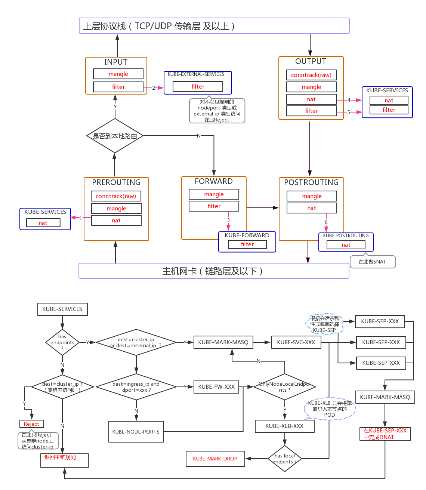

# 背景介绍


`kube-proxy`是`kubernetes`中实现service的通信与负载均衡的重要组件，运行在每个节点上。它通过api-server监听service和endpoint的变化，并根据kube-proxy选择的代理模式(如IPtables模式),来同步本机上IPtables规则，从而实现service间的通信。


本篇文章以IPtables为例，通过源码走读，理解`kube-prixy`的工作流程及实现机制。

# 重要结构体

在走读源码之前，我们先看看`kube-proxy`中几个重要的结构与变量。

## ProxyServer

ProxyServer是整个`kube-proxy`中最重要的结构体，这个结构体中的属性以及方法实现了`kube-proxy`运行所需的所有条件。


[kubernetes/cmd/proxy-server/app/server.go](https://github.com/kubernetes/kubernetes/blob/9a75e7b0fd1b567f774a3373be640e19b33e7ef1/cmd/kube-proxy/app/server.go#L530)

```
// ProxyServer represents all the parameters required to start the Kubernetes proxy server. All
// fields are required.
type ProxyServer struct {
	Client                 clientset.Interface
	EventClient            v1core.EventsGetter
	IptInterface           utiliptables.Interface
	IpvsInterface          utilipvs.Interface
	IpsetInterface         utilipset.Interface
	execer                 exec.Interface
	Proxier                proxy.Provider
	Broadcaster            events.EventBroadcaster
	Recorder               events.EventRecorder
	ConntrackConfiguration kubeproxyconfig.KubeProxyConntrackConfiguration
	Conntracker            Conntracker // if nil, ignored
	ProxyMode              string
	NodeRef                *v1.ObjectReference
	MetricsBindAddress     string
	BindAddressHardFail    bool
	EnableProfiling        bool
	UseEndpointSlices      bool
	OOMScoreAdj            *int32
	ConfigSyncPeriod       time.Duration
	HealthzServer          healthcheck.ProxierHealthUpdater
}
```

- Client: 与api-server交互的客户端
- IptInterface：定于了操作IPtables的所有方法
- IpvsInterface： 定义了操作IPvs的所有方法
- IpsetInterface： 定义了操作IPset的所有方法
- execer：封装golang标准卡os/exec，用于执行command操作
- Proxier： proxier的三种实现(userspace、iptables、ipvs)，
- ProxyMode: 指定的代码模式

## Proxier

Proxier是kube-proxy中三种代理模式的具体实现，每一种模式都有自己的Proxier实现。proxier实现了该模式下的规则同步方法，如IPtables模式：

[kubernetes/pkg/proxy/iptables/proxier.go](https://github.com/kubernetes/kubernetes/blob/fa1b6765d55c3f3c00299a9e279732342cfb00f7/pkg/proxy/iptables/proxier.go#L182)

```
// Proxier is an iptables based proxy for connections between a localhost:lport
// and services that provide the actual backends.
type Proxier struct {
	// endpointsChanges and serviceChanges contains all changes to endpoints and
	// services that happened since iptables was synced. For a single object,
	// changes are accumulated, i.e. previous is state from before all of them,
	// current is state after applying all of those.
	endpointsChanges *proxy.EndpointChangeTracker
	serviceChanges   *proxy.ServiceChangeTracker

	mu           sync.Mutex // protects the following fields
	serviceMap   proxy.ServiceMap
	endpointsMap proxy.EndpointsMap
	portsMap     map[netutils.LocalPort]netutils.Closeable
	nodeLabels   map[string]string
	// endpointSlicesSynced, and servicesSynced are set to true
	// when corresponding objects are synced after startup. This is used to avoid
	// updating iptables with some partial data after kube-proxy restart.
	endpointSlicesSynced bool
	servicesSynced       bool
	initialized          int32
	syncRunner           *async.BoundedFrequencyRunner // governs calls to syncProxyRules
	syncPeriod           time.Duration

	// These are effectively const and do not need the mutex to be held.
	iptables       utiliptables.Interface
	masqueradeAll  bool
	masqueradeMark string
	exec           utilexec.Interface
	localDetector  proxyutiliptables.LocalTrafficDetector
	hostname       string
	nodeIP         net.IP
	portMapper     netutils.PortOpener
	recorder       events.EventRecorder

	serviceHealthServer healthcheck.ServiceHealthServer
	healthzServer       healthcheck.ProxierHealthUpdater

	// Since converting probabilities (floats) to strings is expensive
	// and we are using only probabilities in the format of 1/n, we are
	// precomputing some number of those and cache for future reuse.
	precomputedProbabilities []string

	// The following buffers are used to reuse memory and avoid allocations
	// that are significantly impacting performance.
	iptablesData             *bytes.Buffer
	existingFilterChainsData *bytes.Buffer
	filterChains             utilproxy.LineBuffer
	filterRules              utilproxy.LineBuffer
	natChains                utilproxy.LineBuffer
	natRules                 utilproxy.LineBuffer

	// endpointChainsNumber is the total amount of endpointChains across all
	// services that we will generate (it is computed at the beginning of
	// syncProxyRules method). If that is large enough, comments in some
	// iptable rules are dropped to improve performance.
	endpointChainsNumber int

	// Values are as a parameter to select the interfaces where nodeport works.
	nodePortAddresses []string
	// networkInterfacer defines an interface for several net library functions.
	// Inject for test purpose.
	networkInterfacer utilproxy.NetworkInterfacer
}
```

- endpointsChanges:

`proxy.EndpointChangeTracker ` : 存放了目前所有namespace中暂未处理的endpoint列表
```
// EndpointChangeTracker carries state about uncommitted changes to an arbitrary number of
// Endpoints, keyed by their namespace and name.
type EndpointChangeTracker struct {
	// lock protects items.
	lock sync.Mutex
	// hostname is the host where kube-proxy is running.
	hostname string
	// items maps a service to is endpointsChange.
	items map[types.NamespacedName]*endpointsChange
	// makeEndpointInfo allows proxier to inject customized information when processing endpoint.
	makeEndpointInfo          makeEndpointFunc
	processEndpointsMapChange processEndpointsMapChangeFunc
	// endpointSliceCache holds a simplified version of endpoint slices.
	endpointSliceCache *EndpointSliceCache
	// ipfamily identify the ip family on which the tracker is operating on
	ipFamily v1.IPFamily
	recorder events.EventRecorder
	// Map from the Endpoints namespaced-name to the times of the triggers that caused the endpoints
	// object to change. Used to calculate the network-programming-latency.
	lastChangeTriggerTimes map[types.NamespacedName][]time.Time
	// record the time when the endpointChangeTracker was created so we can ignore the endpoints
	// that were generated before, because we can't estimate the network-programming-latency on those.
	// This is specially problematic on restarts, because we process all the endpoints that may have been
	// created hours or days before.
	trackerStartTime time.Time
}
```

EndpointChangeTracker.items是一个二级的map

`namespace+name`作为一级map的key, value是endpointsChange类型,存放了该endpoints更新前、更新后的所有信息
```
type endpointsChange struct {
	previous EndpointsMap   
	current  EndpointsMap
}
```

EndpointMap:
```
type EndpointsMap map[ServicePortName][]Endpoint
```

ServiceMap的key代表的是service中一组port+protocol，value是该组中所有的endpoint

- serviceChanges: 与endpointChanges类似，serviceChanges中记录了所有service更新前与更新后的信息
- serviceMap: 上面已经介绍过这个结构，serviceMap记录了需要用于更新IPtables规则的service
- endpointMap: 上面已经介绍过这个结构，endpointMap记录了需要用于更新IPtables规则的endpoint
- syncRunner: 这个async.BoundedFrequencyRunner结构体决定了如何触发同步IPtables
- iptablesData： 缓存通过iptables-save的所有iptables信息
- natRules： 缓存nat表上的规则

## 定义的IPtables链

`kube-proxy`在iptables中原有的五条链的基础上，自定义了以下几条链，用于kubernetes中数据包的转发：

[kubernetes/pkg/proxy/iptables/proxier.go#L59](https://github.com/kubernetes/kubernetes/blob/fa1b6765d55c3f3c00299a9e279732342cfb00f7/pkg/proxy/iptables/proxier.go#L59)

```
const (
	// the services chain
	kubeServicesChain utiliptables.Chain = "KUBE-SERVICES"

	// the external services chain
	kubeExternalServicesChain utiliptables.Chain = "KUBE-EXTERNAL-SERVICES"

	// the nodeports chain
	kubeNodePortsChain utiliptables.Chain = "KUBE-NODEPORTS"

	// the kubernetes postrouting chain
	kubePostroutingChain utiliptables.Chain = "KUBE-POSTROUTING"

	// KubeMarkMasqChain is the mark-for-masquerade chain
	KubeMarkMasqChain utiliptables.Chain = "KUBE-MARK-MASQ"

	// KubeMarkDropChain is the mark-for-drop chain
	KubeMarkDropChain utiliptables.Chain = "KUBE-MARK-DROP"

	// the kubernetes forward chain
	kubeForwardChain utiliptables.Chain = "KUBE-FORWARD"

	// kube proxy canary chain is used for monitoring rule reload
	kubeProxyCanaryChain utiliptables.Chain = "KUBE-PROXY-CANARY"
)
```

- kubeServicesChain: 每创建一个`type=ClusterIP`的service，在`KUBE-SERVICES`都有一条对应的规则
- kubeNodePortsChain: 每创建一个`type=NodePort`的service，在`KUBE-NODEPORTS `都有一条对应的规则
- kubePostroutingChain: 当数据包到达`POSTROUTING`上，会跳转到`KUBE-POSTROUTIN`,在此链可能会做一些SNAT(如果匹配MARK)
- KubeMarkMasqChain: 达到此链的数据包，会打上一些标记(MARK: 0x400),标记数据包将会做SNAT
- KubeMarkDropChain: 到达此链的数据包，会打上一些标记(MARK: 0x800),标记数据包将会被抛弃


# 启动流程

`kube-proxy`的入口是在： [kubernetes/cmd/kube-proxy/app/server.go#L305](https://github.com/kubernetes/kubernetes/blob/9a75e7b0fd1b567f774a3373be640e19b33e7ef1/cmd/kube-proxy/app/server.go#L305)

```
// Run runs the specified ProxyServer.
func (o *Options) Run() error {
	defer close(o.errCh)
	if len(o.WriteConfigTo) > 0 {
		return o.writeConfigFile()
	}

	proxyServer, err := NewProxyServer(o)
	if err != nil {
		return err
	}

	if o.CleanupAndExit {
		return proxyServer.CleanupAndExit()
	}

	o.proxyServer = proxyServer
	return o.runLoop()
}

```

`NewProxyServer ` 根据配置参数初始化了一个proxyServer,随后进入到proxyServer.runLoop大循环

## NewProxyServer

我们主要看看这个初始化函数中，主要做了那几件事：
```
func newProxyServer(
	config *proxyconfigapi.KubeProxyConfiguration,
	cleanupAndExit bool,
	master string) (*ProxyServer, error) {

	....

	var iptInterface utiliptables.Interface
	var ipvsInterface utilipvs.Interface
	var kernelHandler ipvs.KernelHandler
	var ipsetInterface utilipset.Interface

	// 1. 创建用于执行命令行参数的exec工具
	execer := exec.New()

	kernelHandler = ipvs.NewLinuxKernelHandler()
	ipsetInterface = utilipset.New(execer)
	canUseIPVS, err := ipvs.CanUseIPVSProxier(kernelHandler, ipsetInterface, config.IPVS.Scheduler)
	if string(config.Mode) == proxyModeIPVS && err != nil {
		klog.ErrorS(err, "Can't use the IPVS proxier")
	}

	if canUseIPVS {
		ipvsInterface = utilipvs.New()
	}

    .....

    // 2. 创建与api-server进行交互的客户端工具
	client, eventClient, err := createClients(config.ClientConnection, master)
	if err != nil {
		return nil, err
	}

	nodeIP := detectNodeIP(client, hostname, config.BindAddress)
	klog.InfoS("Detected node IP", "address", nodeIP.String())

	// Create event recorder
	eventBroadcaster := events.NewBroadcaster(&events.EventSinkImpl{Interface: client.EventsV1()})
	recorder := eventBroadcaster.NewRecorder(scheme.Scheme, "kube-proxy")

	nodeRef := &v1.ObjectReference{
		Kind:      "Node",
		Name:      hostname,
		UID:       types.UID(hostname),
		Namespace: "",
	}

	var healthzServer healthcheck.ProxierHealthUpdater
	if len(config.HealthzBindAddress) > 0 {
		healthzServer = healthcheck.NewProxierHealthServer(config.HealthzBindAddress, 2*config.IPTables.SyncPeriod.Duration, recorder, nodeRef)
	}

	var proxier proxy.Provider
	var detectLocalMode proxyconfigapi.LocalMode

   // 3. 获取选择的模式
	proxyMode := getProxyMode(string(config.Mode), canUseIPVS, iptables.LinuxKernelCompatTester{})
	detectLocalMode, err = getDetectLocalMode(config)
	if err != nil {
		return nil, fmt.Errorf("cannot determine detect-local-mode: %v", err)
	}

	var nodeInfo *v1.Node
	if detectLocalMode == proxyconfigapi.LocalModeNodeCIDR {
		klog.InfoS("Watching for node, awaiting podCIDR allocation", "hostname", hostname)
		nodeInfo, err = waitForPodCIDR(client, hostname)
		if err != nil {
			return nil, err
		}
		klog.InfoS("NodeInfo", "PodCIDR", nodeInfo.Spec.PodCIDR, "PodCIDRs", nodeInfo.Spec.PodCIDRs)
	}

	klog.V(2).InfoS("DetectLocalMode", "LocalMode", string(detectLocalMode))

	primaryProtocol := utiliptables.ProtocolIPv4
	if netutils.IsIPv6(nodeIP) {
		primaryProtocol = utiliptables.ProtocolIPv6
	}
	iptInterface = utiliptables.New(execer, primaryProtocol)

	var ipt [2]utiliptables.Interface
	dualStack := true // While we assume that node supports, we do further checks below

	if proxyMode != proxyModeUserspace {
		.....
	}

    // 4. 初始化IPtables模式的proxier
	if proxyMode == proxyModeIPTables {
		klog.V(0).InfoS("Using iptables Proxier")
		if config.IPTables.MasqueradeBit == nil {
			// MasqueradeBit must be specified or defaulted.
			return nil, fmt.Errorf("unable to read IPTables MasqueradeBit from config")
		}
       // 4.1 如果启用了双栈
		if dualStack {
			klog.V(0).InfoS("kube-proxy running in dual-stack mode", "ipFamily", iptInterface.Protocol())
			klog.V(0).InfoS("Creating dualStackProxier for iptables")
			// Always ordered to match []ipt
			var localDetectors [2]proxyutiliptables.LocalTrafficDetector
			localDetectors, err = getDualStackLocalDetectorTuple(detectLocalMode, config, ipt, nodeInfo)
			if err != nil {
				return nil, fmt.Errorf("unable to create proxier: %v", err)
			}

			// TODO this has side effects that should only happen when Run() is invoked.
			proxier, err = iptables.NewDualStackProxier(
				ipt,
				utilsysctl.New(),
				execer,
				config.IPTables.SyncPeriod.Duration,
				config.IPTables.MinSyncPeriod.Duration,
				config.IPTables.MasqueradeAll,
				int(*config.IPTables.MasqueradeBit),
				localDetectors,
				hostname,
				nodeIPTuple(config.BindAddress),
				recorder,
				healthzServer,
				config.NodePortAddresses,
			)
		} else {

           // 4.2 创建单栈的proxier
			// Create a single-stack proxier if and only if the node does not support dual-stack (i.e, no iptables support).
			var localDetector proxyutiliptables.LocalTrafficDetector
			localDetector, err = getLocalDetector(detectLocalMode, config, iptInterface, nodeInfo)
			if err != nil {
				return nil, fmt.Errorf("unable to create proxier: %v", err)
			}

			// TODO this has side effects that should only happen when Run() is invoked.
			proxier, err = iptables.NewProxier(
				iptInterface,
				utilsysctl.New(),
				execer,
				config.IPTables.SyncPeriod.Duration,
				config.IPTables.MinSyncPeriod.Duration,
				config.IPTables.MasqueradeAll,
				int(*config.IPTables.MasqueradeBit),
				localDetector,
				hostname,
				nodeIP,
				recorder,
				healthzServer,
				config.NodePortAddresses,
			)
		}

		if err != nil {
			return nil, fmt.Errorf("unable to create proxier: %v", err)
		}
		proxymetrics.RegisterMetrics()
	} else if proxyMode == proxyModeIPVS {
		...
	} else {
		...
	}

	useEndpointSlices := true
	if proxyMode == proxyModeUserspace {
		// userspace mode doesn't support endpointslice.
		useEndpointSlices = false
	}

	return &ProxyServer{
		Client:                 client,
		EventClient:            eventClient,
		IptInterface:           iptInterface,
		IpvsInterface:          ipvsInterface,
		IpsetInterface:         ipsetInterface,
		execer:                 execer,
		Proxier:                proxier,
		Broadcaster:            eventBroadcaster,
		Recorder:               recorder,
		ConntrackConfiguration: config.Conntrack,
		Conntracker:            &realConntracker{},
		ProxyMode:              proxyMode,
		NodeRef:                nodeRef,
		MetricsBindAddress:     config.MetricsBindAddress,
		BindAddressHardFail:    config.BindAddressHardFail,
		EnableProfiling:        config.EnableProfiling,
		OOMScoreAdj:            config.OOMScoreAdj,
		ConfigSyncPeriod:       config.ConfigSyncPeriod.Duration,
		HealthzServer:          healthzServer,
		UseEndpointSlices:      useEndpointSlices,
	}, nil
}
```

### iptables.NewProxier

NewProxyServer最重要的是初始化了proxier,下面我们看看iptables.NewProxier的逻辑：

```
func NewProxier(ipt utiliptables.Interface,
	sysctl utilsysctl.Interface,
	exec utilexec.Interface,
	syncPeriod time.Duration,
	minSyncPeriod time.Duration,
	masqueradeAll bool,
	masqueradeBit int,
	localDetector proxyutiliptables.LocalTrafficDetector,
	hostname string,
	nodeIP net.IP,
	recorder events.EventRecorder,
	healthzServer healthcheck.ProxierHealthUpdater,
	nodePortAddresses []string,
) (*Proxier, error) {
	// 1. 为确保某些iptables工作，需要通过sysctl的方式设置`bridge-nf-call-iptables=1`
	if err := utilproxy.EnsureSysctl(sysctl, sysctlRouteLocalnet, 1); err != nil {
		return nil, err
	}

	if val, err := sysctl.GetSysctl(sysctlBridgeCallIPTables); err == nil && val != 1 {
		klog.InfoS("Missing br-netfilter module or unset sysctl br-nf-call-iptables, proxy may not work as intended")
	}

	// 2. 这个masqueradeMark就是用于需要SNAT的标签
	masqueradeValue := 1 << uint(masqueradeBit)
	masqueradeMark := fmt.Sprintf("%#08x", masqueradeValue)
	klog.V(2).InfoS("Using iptables mark for masquerade", "ipFamily", ipt.Protocol(), "mark", masqueradeMark)

	serviceHealthServer := healthcheck.NewServiceHealthServer(hostname, recorder, nodePortAddresses)

	...

	proxier := &Proxier{
		portsMap:                 make(map[netutils.LocalPort]netutils.Closeable),
		serviceMap:               make(proxy.ServiceMap),
		serviceChanges:           proxy.NewServiceChangeTracker(newServiceInfo, ipFamily, recorder, nil),
		endpointsMap:             make(proxy.EndpointsMap),
		endpointsChanges:         proxy.NewEndpointChangeTracker(hostname, newEndpointInfo, ipFamily, recorder, nil),
		syncPeriod:               syncPeriod,
		iptables:                 ipt,
		masqueradeAll:            masqueradeAll,
		masqueradeMark:           masqueradeMark,
		exec:                     exec,
		localDetector:            localDetector,
		hostname:                 hostname,
		nodeIP:                   nodeIP,
		portMapper:               &netutils.ListenPortOpener,
		recorder:                 recorder,
		serviceHealthServer:      serviceHealthServer,
		healthzServer:            healthzServer,
		precomputedProbabilities: make([]string, 0, 1001),
		iptablesData:             bytes.NewBuffer(nil),
		existingFilterChainsData: bytes.NewBuffer(nil),
		filterChains:             utilproxy.LineBuffer{},
		filterRules:              utilproxy.LineBuffer{},
		natChains:                utilproxy.LineBuffer{},
		natRules:                 utilproxy.LineBuffer{},
		nodePortAddresses:        nodePortAddresses,
		networkInterfacer:        utilproxy.RealNetwork{},
	}

	burstSyncs := 2
	klog.V(2).InfoS("Iptables sync params", "ipFamily", ipt.Protocol(), "minSyncPeriod", minSyncPeriod, "syncPeriod", syncPeriod, "burstSyncs", burstSyncs)
	
   // 3. 上面我们提到过`async.BoundedFrequencyRunner`这个结构体决定了什么时候触发更新IPtables规则
   // 值得注意的是: 传入的proxier.syncProxyRules方法是同步IPtables规则的核心逻辑
   // 我们下面着重讲解

	proxier.syncRunner = async.NewBoundedFrequencyRunner("sync-runner", proxier.syncProxyRules, minSyncPeriod, time.Hour, burstSyncs)

	go ipt.Monitor(kubeProxyCanaryChain, []utiliptables.Table{utiliptables.TableMangle, utiliptables.TableNAT, utiliptables.TableFilter},
		proxier.syncProxyRules, syncPeriod, wait.NeverStop)

	if ipt.HasRandomFully() {
		klog.V(2).InfoS("Iptables supports --random-fully", "ipFamily", ipt.Protocol())
	} else {
		klog.V(2).InfoS("Iptables does not support --random-fully", "ipFamily", ipt.Protocol())
	}

	return proxier, nil
}
```


## proxyServer.runLoop

在proxyServer初始化完成之后，就进入到了runLoop大循环，调用顺序:

proxyServer.runLoop -> proxyServer.Run方法：

```
func (s *ProxyServer) Run() error {
	// To help debugging, immediately log version
	klog.InfoS("Version info", "version", version.Get())

	// 设置OOM参数，通过写入参数`OOMScoreAdj`，来改变进程的oom_adj内核参数
	var oomAdjuster *oom.OOMAdjuster
	if s.OOMScoreAdj != nil {
		oomAdjuster = oom.NewOOMAdjuster()
		if err := oomAdjuster.ApplyOOMScoreAdj(0, int(*s.OOMScoreAdj)); err != nil {
			klog.V(2).InfoS("Failed to apply OOMScore", "err", err)
		}
	}

	if s.Broadcaster != nil && s.EventClient != nil {
		stopCh := make(chan struct{})
		s.Broadcaster.StartRecordingToSink(stopCh)
	}

	// TODO(thockin): make it possible for healthz and metrics to be on the same port.

	var errCh chan error
	if s.BindAddressHardFail {
		errCh = make(chan error)
	}

	// 监控相关
	serveHealthz(s.HealthzServer, errCh)

	// Start up a metrics server if requested
	serveMetrics(s.MetricsBindAddress, s.ProxyMode, s.EnableProfiling, errCh)

	// Tune conntrack, if requested
	// Conntracker is always nil for windows
	if s.Conntracker != nil {
		...
	}

	noProxyName, err := labels.NewRequirement(apis.LabelServiceProxyName, selection.DoesNotExist, nil)
	if err != nil {
		return err
	}

	noHeadlessEndpoints, err := labels.NewRequirement(v1.IsHeadlessService, selection.DoesNotExist, nil)
	if err != nil {
		return err
	}

	labelSelector := labels.NewSelector()
	labelSelector = labelSelector.Add(*noProxyName, *noHeadlessEndpoints)

	// 初始化informerFactory
	informerFactory := informers.NewSharedInformerFactoryWithOptions(s.Client, s.ConfigSyncPeriod,
		informers.WithTweakListOptions(func(options *metav1.ListOptions) {
			options.LabelSelector = labelSelector.String()
		}))

	// serviceConfig监听service信息的变化，并启动一个协程进行监听
   // config.NewServiceConfig中会去注册`AddFunc、UpdateFunc、DeleteFunc`事件
   // 当上述事件发生时，就会调用对应的函数进行处理
   // endpointsConfig也是一样
	serviceConfig := config.NewServiceConfig(informerFactory.Core().V1().Services(), s.ConfigSyncPeriod)
	serviceConfig.RegisterEventHandler(s.Proxier)
	go serviceConfig.Run(wait.NeverStop)

    // 同样，启动协程监听endpoint的变化
	if endpointsHandler, ok := s.Proxier.(config.EndpointsHandler); ok && !s.UseEndpointSlices {
		endpointsConfig := config.NewEndpointsConfig(informerFactory.Core().V1().Endpoints(), s.ConfigSyncPeriod)
		endpointsConfig.RegisterEventHandler(endpointsHandler)
		go endpointsConfig.Run(wait.NeverStop)
	} else {
		endpointSliceConfig := config.NewEndpointSliceConfig(informerFactory.Discovery().V1().EndpointSlices(), s.ConfigSyncPeriod)
		endpointSliceConfig.RegisterEventHandler(s.Proxier)
		go endpointSliceConfig.Run(wait.NeverStop)
	}

	// 启动informerFactory
	informerFactory.Start(wait.NeverStop)

	if utilfeature.DefaultFeatureGate.Enabled(features.TopologyAwareHints) {
		// Make an informer that selects for our nodename.
		currentNodeInformerFactory := informers.NewSharedInformerFactoryWithOptions(s.Client, s.ConfigSyncPeriod,
			informers.WithTweakListOptions(func(options *metav1.ListOptions) {
				options.FieldSelector = fields.OneTermEqualSelector("metadata.name", s.NodeRef.Name).String()
			}))
		nodeConfig := config.NewNodeConfig(currentNodeInformerFactory.Core().V1().Nodes(), s.ConfigSyncPeriod)
		nodeConfig.RegisterEventHandler(s.Proxier)
		go nodeConfig.Run(wait.NeverStop)

		// This has to start after the calls to NewNodeConfig because that must
		// configure the shared informer event handler first.
		currentNodeInformerFactory.Start(wait.NeverStop)
	}

	// Birth Cry after the birth is successful
	s.birthCry()
    
   // 启动一个协程，进入到proxier.SyncLoop
	go s.Proxier.SyncLoop()

	return <-errCh
}
```

### Proxier.SyncLoop()

函数调用顺序：

s.Proxier.SyncLoop() -> proxier.syncRunner.Loop():

我们上面提到过`async.BoundedFrequencyRunner`这个结构体，这里采用经典的`for` + `select`来完成监听事件并触发处理。

bfr.tryRun()会调用proxier.SyncRules()来进行IPtables规则的同步。

```
func (bfr *BoundedFrequencyRunner) Loop(stop <-chan struct{}) {
	klog.V(3).Infof("%s Loop running", bfr.name)
	bfr.timer.Reset(bfr.maxInterval)
	for {
		select {
       // 如果接收到stop信号，则停止运行
		case <-stop:
			bfr.stop()
			klog.V(3).Infof("%s Loop stopping", bfr.name)
			return
       // 如果是timer触发，则手动调用。
       // `kube-proxy`为了防止一些意外事件影响到IPtables规则，所以间隔一段时间手动的重新同步规则
       // 这个间隔时间不固定的，采用限流算法来确定触发间隔。
		case <-bfr.timer.C():
			bfr.tryRun()
       // 监听到service、endpoint更新
		case <-bfr.run:
			bfr.tryRun()
       // 接收到重试的信号
		case <-bfr.retry:
			bfr.doRetry()
		}
	}
}
```

# IPtables规则同步

到目前为止，初始化已经完成，监听也开始。接下来，我们开始看看当监听到有service或endpoint的变化时，IPtables规则时如何同步的。

因为service和endpoint的处理方式时是类似的，所以我们以service为例，来看看是如何处理的。

[kubernetes/pkg/proxy/iptables/proxier.go#L552](https://github.com/kubernetes/kubernetes/blob/9a75e7b0fd1b567f774a3373be640e19b33e7ef1/pkg/proxy/iptables/proxier.go#L552)

```
func (proxier *Proxier) OnServiceAdd(service *v1.Service) {
	proxier.OnServiceUpdate(nil, service)
}

// OnServiceUpdate is called whenever modification of an existing
// service object is observed.
func (proxier *Proxier) OnServiceUpdate(oldService, service *v1.Service) {
	if proxier.serviceChanges.Update(oldService, service) && proxier.isInitialized() {
		proxier.Sync()
	}
}

// OnServiceDelete is called whenever deletion of an existing service
// object is observed.
func (proxier *Proxier) OnServiceDelete(service *v1.Service) {
	proxier.OnServiceUpdate(service, nil)

}

```

可以看到，service的Add、Update、Delete事件都会去调用proxier.serviceChanges.Update()方法，这个方法会去对比old service和new service是否一样。如果不一样的话，就会调用proxier.Sync()方法，这个方法会响bfr.run中写入一个channel，进而触发bfr.tryRun()，从而去同步规则。

我们大致看一下proxier.serviceChanges.Update()的逻辑：
```
func (sct *ServiceChangeTracker) Update(previous, current *v1.Service) bool {
	svc := current
	if svc == nil {
		svc = previous
	}
	// previous == nil && current == nil is unexpected, we should return false directly.
	if svc == nil {
		return false
	}
	metrics.ServiceChangesTotal.Inc()
   
   // key为`namespace+svcName`
	namespacedName := types.NamespacedName{Namespace: svc.Namespace, Name: svc.Name}

	sct.lock.Lock()
	defer sct.lock.Unlock()
   
	change, exists := sct.items[namespacedName]
    // 如果不存在这个service，那就初始化一个serviceChange
    // 并得到change.previous
    // 注：change.previous可能为nil
	if !exists {
		change = &serviceChange{}
		change.previous = sct.serviceToServiceMap(previous)
		sct.items[namespacedName] = change
	}
    // 得到change.current
	change.current = sct.serviceToServiceMap(current)
    // DeepEqual previous和current是否相等
    // 如果相等就不需要同步规则了
	if reflect.DeepEqual(change.previous, change.current) {
		delete(sct.items, namespacedName)
	} else {
		klog.V(2).InfoS("Service updated ports", "service", klog.KObj(svc), "portCount", len(change.current))
	}
	metrics.ServiceChangesPending.Set(float64(len(sct.items)))
    // sct.items代表的是有变化的service列表
    // 如果len(sct.items) > 0，则说明需要更新规则
	return len(sct.items) > 0
}
```

接下来我们看看当`bfr.tryRun`被调用时，真正执行的proxier.SyncRules()

## proxier.SyncRules()

现在我们已经拿到变化的service列表和endpoint列表，proxier.SyncRules()的逻辑就是将这些变化反映到IPtables中去。这段代码很长，大约700多行，我们不逐一展开，着重看看这里时如何根据变化的信息去生成对应的IPtables规则的。

[kubernetes/pkg/proxy/iptables/proxier.go#L780](https://github.com/kubernetes/kubernetes/blob/9a75e7b0fd1b567f774a3373be640e19b33e7ef1/pkg/proxy/iptables/proxier.go#L780)

1. 获取需要同步iptabels规则的service和endpoint
```
func (proxier *Proxier) syncProxyRules() {
	proxier.mu.Lock()
	defer proxier.mu.Unlock()
    ...
	serviceUpdateResult := proxier.serviceMap.Update(proxier.serviceChanges)
	endpointUpdateResult := proxier.endpointsMap.Update(proxier.endpointsChanges)
```

serviceUpdateResult和endpointUpdateResult分别存放着需要更新IPtables的service和endpoint

proxier.serviceMap.Update(): 将proxier.serviceChanges.current写入到proxier.serviceMap中，并将存在于proxier.serviceChanges.previous中但不存在于proxier.serviceChanges.current中的srevice从proxier.serviceMap中删除。
```
func (sm ServiceMap) Update(changes *ServiceChangeTracker) (result UpdateServiceMapResult) {
	result.UDPStaleClusterIP = sets.NewString()
	sm.apply(changes, result.UDPStaleClusterIP)

	// TODO: If this will appear to be computationally expensive, consider
	// computing this incrementally similarly to serviceMap.
	result.HCServiceNodePorts = make(map[types.NamespacedName]uint16)
	for svcPortName, info := range sm {
		if info.HealthCheckNodePort() != 0 {
			result.HCServiceNodePorts[svcPortName.NamespacedName] = uint16(info.HealthCheckNodePort())
		}
	}

	return result
}
```

主要的逻辑在sm.apply()中：
```
func (sm *ServiceMap) apply(changes *ServiceChangeTracker, UDPStaleClusterIP sets.String) {
	changes.lock.Lock()
	defer changes.lock.Unlock()
	for _, change := range changes.items {
		if changes.processServiceMapChange != nil {
			changes.processServiceMapChange(change.previous, change.current)
		}
       // 将change.current合并到serviceMap中
		sm.merge(change.current)
		// filter out the Update event of current changes from previous changes before calling unmerge() so that can
		// skip deleting the Update events.
       // 过滤同时存在于previous和current中的serviceMap
		change.previous.filter(change.current)
		sm.unmerge(change.previous, UDPStaleClusterIP)
	}
	// clear changes after applying them to ServiceMap.
    // 注意，这里数据处理完成后将items置为nil了
	changes.items = make(map[types.NamespacedName]*serviceChange)
	metrics.ServiceChangesPending.Set(0)
}
```

同理，proxier.endpointMap.Update()方法也是类似的。

2. 刷新iptables的前置操作
   2.1 确保kubernetes的一些链表存在
   因为service和endpoint对应的规则都会插入到kubernetes的一些自定义链表上，所以我们应该首先确认这些自定义的链表是否存在。

```
// Create and link the kube chains.
	for _, jump := range iptablesJumpChains {
		if _, err := proxier.iptables.EnsureChain(jump.table, jump.dstChain); err != nil {
			klog.ErrorS(err, "Failed to ensure chain exists", "table", jump.table, "chain", jump.dstChain)
			return
		}
		args := append(jump.extraArgs,
			"-m", "comment", "--comment", jump.comment,
			"-j", string(jump.dstChain),
		)
		if _, err := proxier.iptables.EnsureRule(utiliptables.Prepend, jump.table, jump.srcChain, args...); err != nil {
			klog.ErrorS(err, "Failed to ensure chain jumps", "table", jump.table, "srcChain", jump.srcChain, "dstChain", jump.dstChain)
			return
		}
	}

	// ensure KUBE-MARK-DROP chain exist but do not change any rules
	for _, ch := range iptablesEnsureChains {
		if _, err := proxier.iptables.EnsureChain(ch.table, ch.chain); err != nil {
			klog.ErrorS(err, "Failed to ensure chain exists", "table", ch.table, "chain", ch.chain)
			return
		}
	}
```

2.2 导出目前filter表和nat表上的规则

将通过执行命令`iptables-save -t nat/filter`目前内核中的filter和nat表上的规则全部导出来
```
// Get iptables-save output so we can check for existing chains and rules.
	// This will be a map of chain name to chain with rules as stored in iptables-save/iptables-restore
	existingFilterChains := make(map[utiliptables.Chain][]byte)
	proxier.existingFilterChainsData.Reset()
	err := proxier.iptables.SaveInto(utiliptables.TableFilter, proxier.existingFilterChainsData)
	if err != nil { // if we failed to get any rules
		klog.ErrorS(err, "Failed to execute iptables-save, syncing all rules")
	} else { // otherwise parse the output
		existingFilterChains = utiliptables.GetChainLines(utiliptables.TableFilter, proxier.existingFilterChainsData.Bytes())
	}

	// IMPORTANT: existingNATChains may share memory with proxier.iptablesData.
	existingNATChains := make(map[utiliptables.Chain][]byte)
	proxier.iptablesData.Reset()
	err = proxier.iptables.SaveInto(utiliptables.TableNAT, proxier.iptablesData)
	if err != nil { // if we failed to get any rules
		klog.ErrorS(err, "Failed to execute iptables-save, syncing all rules")
	} else { // otherwise parse the output
		existingNATChains = utiliptables.GetChainLines(utiliptables.TableNAT, proxier.iptablesData.Bytes())
	}
```

2.3 将已存在或新创建的链写入到buffer中
```
// Write table headers.
	proxier.filterChains.Write("*filter")
	proxier.natChains.Write("*nat")

	// Make sure we keep stats for the top-level chains, if they existed
	// (which most should have because we created them above).
	for _, chainName := range []utiliptables.Chain{kubeServicesChain, kubeExternalServicesChain, kubeForwardChain, kubeNodePortsChain} {
		if chain, ok := existingFilterChains[chainName]; ok {
			proxier.filterChains.WriteBytes(chain)
		} else {
			proxier.filterChains.Write(utiliptables.MakeChainLine(chainName))
		}
	}
	for _, chainName := range []utiliptables.Chain{kubeServicesChain, kubeNodePortsChain, kubePostroutingChain, KubeMarkMasqChain} {
		if chain, ok := existingNATChains[chainName]; ok {
			proxier.natChains.WriteBytes(chain)
		} else {
			proxier.natChains.Write(utiliptables.MakeChainLine(chainName))
		}
	}
```

3. 根据serviceMap和endpointMap的信息，生成对应的IPtables规则

我们这里只看type=CluseterIP的service。遍历proxier.serviceMap，对于每个service：

    a. 在nat表中写入一条： `KUBE-SVC-XXX`。这个XXX的值是通过对`namespace+name+portname+protocol`区hash运算，并取前16位生成。

    b. kube-proxy 会对目的地址是{cluster_ip:port} 的集群外部（! -s ${cluster_cidr}）流量包打标签，进而做SNAT

    c. 将目的地址是{cluster_ip:port} 的流量导入到KUBE-SVC-XXX

    d. 如果服务没有endpoints, 在KUBE-SERVICES链上建立filter 规则（（将规则写入proxier.filterRules），表示放弃访问目的地址{cluster_ip:port}的包

与下面类似：
```
-A KUBE-SERVICES ... --comment ${svc-port-name} cluster IP ... -d ${cluster_ip}/32 -dport XXX  ! -s ${cluster_cidr}  -j KUBE-MARK-MASQ  // 
-A KUBE-SERVICES ... --comment ${svc-port-name} cluster IP ... -d ${cluster_ip}/32 -dport xxx  -j  KUBE-SVC-XXX // 有endpoints 时添加此规则  
-A KUBE-SERVICES ... --comment {svc-port-name} has no endpoints ... -d ${cluster_ip}/32  -dport xxx  -j REJECT  // 没有endpoint时，直接将发往此IP：Port的包丢弃
```

4. 保存iptables规则
   在所有iptables生成完成之后，调用命令`iptables-restore`保存所有的规则
```
klog.V(5).InfoS("Restoring iptables", "rules", proxier.iptablesData.Bytes())
	err = proxier.iptables.RestoreAll(proxier.iptablesData.Bytes(), utiliptables.NoFlushTables, utiliptables.RestoreCounters)
	if err != nil {
		klog.ErrorS(err, "Failed to execute iptables-restore")
		metrics.IptablesRestoreFailuresTotal.Inc()
		// Revert new local ports.
		klog.V(2).InfoS("Closing local ports after iptables-restore failure")
		utilproxy.RevertPorts(replacementPortsMap, proxier.portsMap)
		return
	}
```


# 总结

总的来看，kube-proxy的逻辑并不是很复杂，逻辑就是根据service和endpoint的变化来更新主机上的iptables，但是比较难的点是需要理解linux的netfilter框架，理解内核处理数据包的流程。如果理解netfilter，那么理解kube-proxy也就不难了。

流程参考：



# 参考链接

一个比较好的源码分析系列:[https://rootdeep.github.io/posts/kube-proxy-code-analysis/](https://rootdeep.github.io/posts/kube-proxy-code-analysis/)

理解kubernetes的IPtables:[https://www.cnblogs.com/charlieroro/p/9588019.html](https://www.cnblogs.com/charlieroro/p/9588019.html)

一个比较好的IPtables学习视频:[https://www.bilibili.com/video/BV1ED4y197yM/?spm_id_from=333.788.recommend_more_video.4](https://www.bilibili.com/video/BV1ED4y197yM/?spm_id_from=333.788.recommend_more_video.4)


