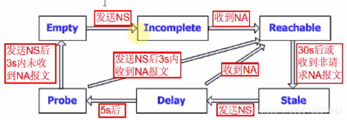
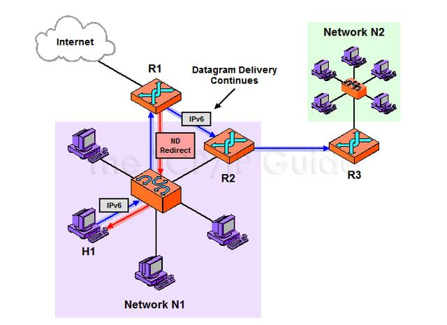

## 邻居发现协议
邻居发现协议（NDP, Neighbor Discovery Protocol）工作在网络层，负责在链路上发现其他节点和相应的地址，并确定可用路由、维护关于可用路径和其他活动节点的可达性信息。NDP 是 IPv6 的一个基本功能。

NDP 替代了 IPv4 的 ARP，并且添加了新的功能。它的所有功能都基于 ICMPv6 报文来实现。使用组播方式发送请求报文，减少了二层网络的性能压力。

### NDP 报文
NDP 报文是在数据链路内接收和发送，因此封装 NDP 的数据包是使用 IPv6 链路本地地址，或者是链路范围内的组播地址。

NDP 定义了 5 种报文类型，且 Hop Limit 字段值都是 255 。IPv6 数据报 Hop Limit 最大值为 255，每经过一个路由器转发都会减少 1。如果收到的 NDP 报文中 Hop Limit 字段值不是 255 ，那么会丢弃这个 NDP 报文。这样不会受到非本地链路的攻击或欺骗。

TYPE | CODE | Description
:-----:|:------:|:-------------
133 | 0 | 路由器请求（Router Solicitation ，RS）
134 | 0 | 路由器通告（Router Advertisement ，RA）
135 | 0 | 邻居请求（Neighbor Solicitation ，NS）
136 | 0 | 邻居通告（Neighbor Advertisement ，NA）
137 | 0 | 重定向（Redirect）

- 路由器请求报文由主机发出，用来请求链路中的路由器。
- 路由器通告报文由路由器发出，用来通告路由器的存在和链路参数，比如：链路前缀、链路 MTU ，以及跳数限制等。这些报文周期性的发送，也用于响应路由器请求报文。
- 邻居请求报文由主机发起，通过组播方式，用来请求另一台主机的 MAC 地址，也用于地址冲突检测、邻居不可达检测。
- 邻居通告报文用于响应邻居请求报文，通过单播方式。如果一个节点改变了 MAC 地址，那么它通过发送一个未请求的邻居通告报文来告知这个新地址。
- 重定向和 IPv4 中的 ICMP 用法相同。

### NDP 功能
1. 路由器发现 Router Discovery，通过路由器请求报文和路由器通告报文。
2. 前缀发现 Prefix Discovery，通过路由器请求报文和路由器通告报文。
3. 参数发现 Parameter Discovery，通过路由器请求报文和路由器通告报文。
4. 地址自动配置 Address Autoconfiguration，通过 IPv6 的链路本地地址。
5. 地址解析 Address Resolution，通过邻居请求报文和邻居通告报文。
6. 下一跳确定 Next-Hop Determination，通过路由器请求报文和路由器通告报文。
7. 邻居不可达检测 Neighbor Unreachability Detection，通过邻居请求报文和邻居通告报文。
8. 地址冲突检测 Duplicate Address Detection，通过邻居请求报文和邻居通告报文。
9. 重定向 Redirect，通过重定向报文。

### 路由器发现
路由器在所在的链路上周期性发送 RA ，告知它的存在和配置的所有参数。周期性的 RA 的源地址是路由器接口的 [链路本地地址](IPv6.md#链路本地地址)，目的地址是所有节点的 [组播地址](IPv6.md#组播)（ff02::1）。

刚接入到链路的主机，需要等待一个 RA 来发现链路上的路由器和链路参数。而默认等待的时间太长。所以，主机接入到链路之后就会发送一个 RS ，这个报文的源地址可以是 [未指定地址](IPv6.md#未指定地址)（::），也可以是主机的链路本地地址。目的地址就是所有路由器的组播地址（ff02::2），请求链路本地路由器为主机提供一些信息。

只有路由器才会监听链路本地路由器组播地址，当路由器收到 RS 时，就会发送一条 RA 作为响应。如果收到报文的源地址是链路本地地址，那么使用链路本地地址单播发送。如果源地址是未指定地址，那么会以组播方式发送给所有节点（ff02::1）。

当主机收到 RS 时，会把路由器的链路本地地址作为默认路由地址，添加到自己的路由表中。如果路由器列表有多条默认路由器条目，那么主机要给出选定默认路由器的方法。要么是整个默认路由器列表依次轮询，要么选择单台路由器作为默认路由。

### 地址自动配置
主机接上链路之后会自动配置链路本地地址。

如果主机需要和链路之外的设备通信，就需要一个更大范围的地址，通常是一个 [全球单播地址](IPv6.md#全球单播地址)。有两种途径获取这类地址：有状态或无状态的地址自动配置。

RA 有一个字段可以告诉 IPv6 设备使用哪种方式配置自己的 IPv6 地址，这个字段称为 M 位。如果 M 位置位，值为 1 时，表示设备通过 DHCPv6 协议动态配置 IPv6 地址；如果 M 位不置位，值为 0 时，表示设备通过 SLAAC 来配置 IPv6 地址。

有状态地址自动配置通过 DHCPv6 服务器来分配 IPv6 地址。主机要么根据预先的配置查找 DHCPv6 服务器，要么收到字段 M 置位的路由器通告报文来获取 DHCPv6 服务器。

无状态地址自动配置（Stateless Address Autoconfiguration, SLAAC），不依赖服务器、不需要手动配置。当一台 IPv6 设备接入网络时，会发送 RS 来查询网络中是否存在路由器。IPv6 设备从收到的 RA 中获取一个或多个链路前缀，再加上之前确定的接口 ID ，就得到了一个全球唯一的 IPv6 地址。

IPv6 设备执行 SLAAC 的过程，不需要人工干预，也没有 DHCP 服务器参与，设备自行完成配置。这种机制为 IPv6 网络提供了即插即用功能。

### 邻居地址解析
IPv6 中没有广播，因此通过 NDP 获取目的主机 MAC 地址。IPv6 使用 [目的节点组播地址](IPv6.md#目的节点组播地址) 作为 NS 的目的地址。

如果目的节点是链路之外的节点，那么可以通过路由器通告报文，获取默认路由器的 MAC 地址。

如果目的节点在链路内，会先查找邻居缓存,看一下是否已经有记录。IPv6 的邻居缓存和 IPv4 的 ARP 缓存类似，记录 IP 地址和 MAC 地址的对应关系。

如果地址不在邻居缓存中，节点会发送一个 NS。目的节点收到报文后，就知道源节点的 MAC 地址，并回复 NA。

NDP 的 NA 还有另一种用法，当 IPv6 节点的 MAC 地址发生变化时，也可以在未收到 NS 的情况下，直接向本地链路发送一条目的地址为链路本地所有节点组播地址（ff02::1）的 NA ，向本地链路上其它设备通告新的 IPv6 地址和 MAC 地址的对应关系。

### 地址冲突检测
虽然通过 MAC 地址转换成接口 ID，大多数情况下可以保证是设备地址是唯一的，但是也可能存在重复 MAC 地址的情况，因此不管设备是如何获取地址的，都需要在使用之前进行地址冲突检测。

获取一个地址的节点会把新地址作为临时状态的地址。在地址冲突检测完成前，地址不能被使用。节点会发送 NS 报文来验证地址是否有冲突。NS 源地址是未指定地址，目的地址是新地址对应的目的节点组播地址。源节点收到 NA 后，就会知道这个地址是冲突的，并且不能使用。

### 跟踪邻居状态
验证某相邻节点是否可达时，NS 报文首部中目的地址是邻居的单播地址。

### 重定向

上图主机 H1 要发送数据到网络 N2，经过路由器 R1，由 R1 转发到 R2，但路由器 R1 发现 R2 与它是同一网段，这时候路由器 R1 就发送重定向报文（ND redirect）告诉主机 H1，以后发送给网络 N2 的报文直接发送给 R2。

### 私有地址
SLAAC 有一个安全隐患：即使一台设备从一个子网转移到另一个子网，它的接口 ID 始终保持不变。那么就可以通过接口 ID 来识别用户，推断出用户的所在位置，追踪用户的活动和位置记录，暴露个人隐私信息。

这个问题可以通过 IPv6 私有地址来解决。私有地址是随机生成的接口 ID 。接口 ID 通常一天变化一次，也会在获取一个新的 IPv6 地址时改变。

但是服务器的地址不需要经常变化。跟服务器通信的节点，以及 DNS 服务器必须通过静态地址了解服务器的位置。因此，标准的无状态配置的 IPv6 地址保留“公共”地址。向服务器发送数据时，使用这个地址作为目的地址。但是服务器发送数据时，使用的是私有地址。

### 参考
1. [图解 IPv6 ：IPv4 都用完了，赶紧看看它](https://mp.weixin.qq.com/s/3PyqPDfGKVb5HdkH-iNTXA)
