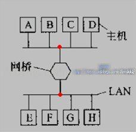
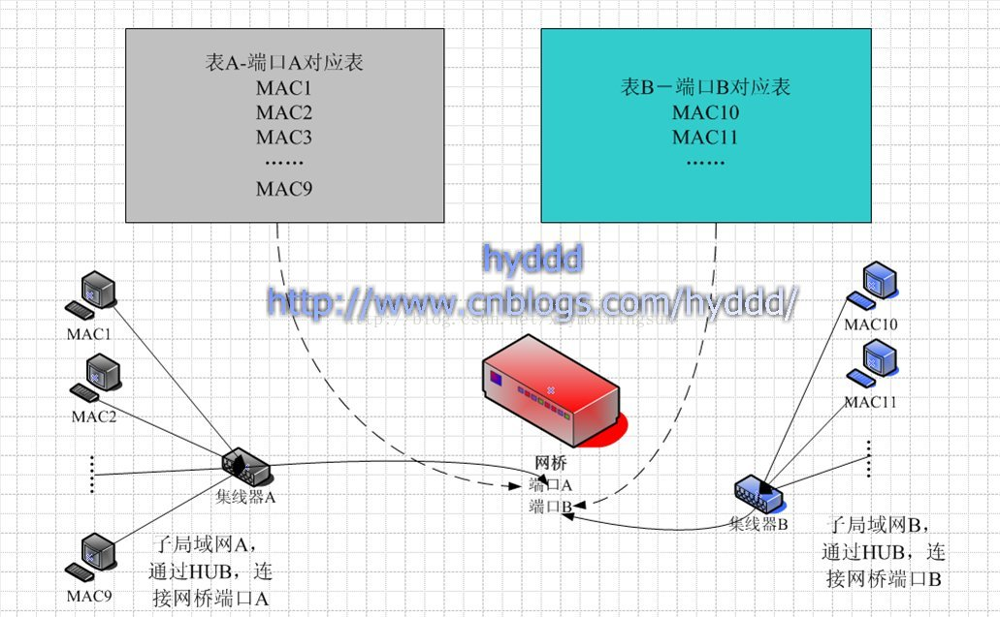
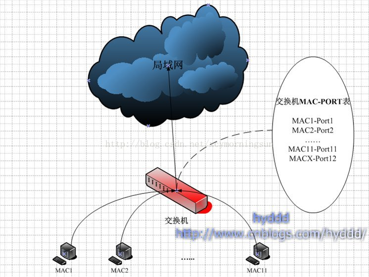

## 数据链路层设备
### 网桥 Network Bridge
- 网桥的连接模式：(红点处为HUB)

- 网桥只有2个输入/出端口，而交换机有多个。
- 一开始只有 HUB 这种设备。为了提高局域网效率，发明了网桥（一个只有两个输入/出端口的链路层设备），然后把一个局域网一分为二，中间用网桥连接，这样 A 发给 BCD 的数据就不会再广播到 EFGH 了(网桥发现如果数据包不是转发给下面这个子网的，它会自动丢弃此包)，只有从 A 发到 EFGH 的数据包才能通过网桥，到达另外一个子网(网桥发现如果数据包是转发给下面这个子网的，它才会把包转发给这个子网)。这样一来，非必要的传输减少了，整个网络的效率也随之提高不少。随着硬件发展，出现了 4 个，8 个端口的链路层设备，这就是交换机，由于交换机可以使得网络更安全(数据不容易被监听，因为数据不再广播了)，网络效率更高(还是因为数据不再广播)，交换机渐渐替代了HUB，成为组建局域网的重要设备。
- 网桥有一个 MAC 地址对应端口的表。

- 网桥不是用来连接不同网段的，是连接两个子局域网，是基于 MAC 地址进行数据转发。不同网段之间通信，需要网关的帮助,在没有路由器的情况下，两个网络之间是不能进行 TCP/IP 通信的，即使是两个网络连接在同一台交换机（或集线器）上，TCP/IP 协议也会根据子网掩码（255.255.255.0）判定两个网络中的主机处在不同的网络里。而要实现这两个网络之间的通信，则必须通过网关。
- 网桥或交换机是链路层设备，网段这个是和 IP 相关的概念，属于网络层。

### 交换机 Switch
- 交换机工作：
  1. 主机 A 想和 B 通信，发送源 MAC 地址为自己，目标 MAC 地址为 B 的数据帧给交换机。
  2. 交换机在接收到数据帧以后，首先会记录数据帧中的源 MAC 地址和对应的接口到 MAC 表中，接着会检查自己的 MAC 表中是否有数据帧中目标 MAC 地址的信息，如果有则会根据 MAC 表中记录的对应接口将数据帧发送出去(单播)，如果没有，则会将该数据帧从非接受接口发送出去(广播)。
  3. 多个交换机互连也是先广播，通信过一次就变成单播。多个交换机也是遵循收到数据帧，没有就记录到表里。
- 获得目标主机的 MAC 地址 - ARP 协议，是工作在网络层的协议，它负责将 IP 地址解析为 MAC 地址。每台主机中都有一张 ARP 表，它记录着主机的 IP 地址和 MAC 地址的对应关系。
  1. 如果主机 A 想发送数据给主机 B ，主机 A 首先会检查自己的 ARP 缓存表，查看是否有主机 B 的 IP 地址和 MAC 地址的对应关系，如果有，则会将主机 B 的 MAC 地址作为源 MAC 地址封装到数据帧中。如果没有，主机 A 则会发送一个 ARP 请求信息，请求的目标 IP 地址是主机 B 的 IP 地址，目标 MAC 地址是 MAC 地址的广播帧(即FF-FF-FF-FF-FF-FF)，源 IP 地址和 MAC 地址是主机 A 的 IP 地址和 MAC 地址。
  2. 当交换机接受到此数据帧之后，发现此数据帧是广播帧，因此，会将此数据帧从非接收的所有接口发送出去。
  3. 当主机 B 接受到此数据帧后，会校对 IP 地址是否是自己的，并将主机 A 的 IP 地址和 MAC 地址的对应关系记录到自己的 ARP 缓存表中，同时会发送一个 ARP 应答，其中包括自己的 MAC 地址。
  4. 主机 A 在收到这个回应的数据帧之后，在自己的 ARP 缓存表中记录主机 B 的 IP 地址和 MAC 地址的对应关系。而此时交换机已经学习到了主机 A 和主机 B 的 MAC 地址了。

