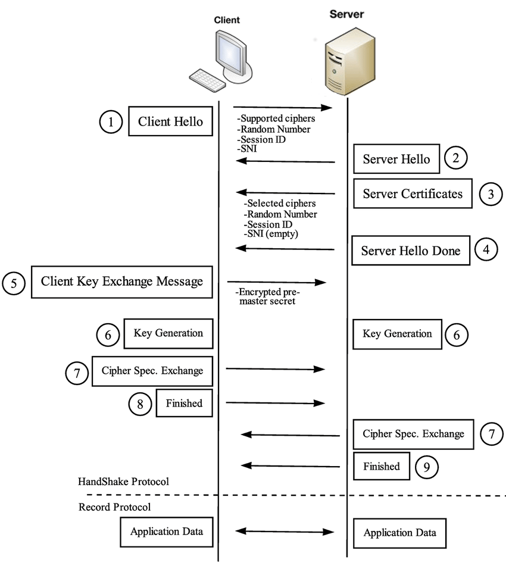

## TLS
### 相关概念
SSL: Secure Socket Layer，安全套接字层，http 层下新增加的这一层构成了 https。

TLS: Transport Layer Security，为了保证数据安全的加密协议层，是 SSL 的增强版，SSL 有 1.0，2.0，3.0 版本，TLS 目前有 1.0，1.1，1.2，1.3。TLS 的 1.0 版本就是 SSL 的 3.0。

Key: https 中有公钥和私钥，用公钥加密的内容，可以使用私钥解密，反之亦然。一般情况下所说的 key 文件指私钥文件。

CRT: certificate 证书文件，是证书机构颁发的保证安全通信的文件，由域名、公司信息、序列号和签名信息等组成。

CER: 也是证书文件，和 CRT 相比只是缩写不同，CRT 缩写常见于类 unix 系统，CER 缩写常见于Windows 系统。

X.509: 这里特指颁发的证书的格式，而其根据不同的编码格式分为 PEM 和 DER
- PEM - Privacy Enhanced Mail,文本内容以"-----BEGIN..."开头,"-----END..."结尾,内容是 BASE64 编码,较为常见，nginx 使用的就是这种。
- DER - Distinguished Encoding Rules,打开是二进制格式,不可读。Java 和 Windows 服务器偏向于使用这种编码格式。

CSR: Certificate Signing Request 证书签名请求，里面包含公钥等个体信息，公证机构通过这个颁发证书。

CA: Certificate Authority 证书颁发机构，它的作用就是给各个用户签发证书等，比如说 Symantec、Comodo、GoDaddy、GlobalSign 和 DigiCert 等。

openssl: 相当于SSL的一个实现/工具，包括对证书的解析，个人颁发，证书编码转化等。通常用 key 指代私钥，用 pem 指代公钥。

### 摘要算法
摘要算法常见有 MD5、SHA1、SHA256。这些算法对输入敏感，输出长度固定，输入的一点修改就会引起输出较大的变化，且不可逆，即无法通过输出获得输入。输出又称为摘要。散列函数可以用来防止数据被篡改以及校验数据的完整性。

在信息传输过程中，散列函数不能单独实现信息防篡改。如果采用明文传输，中间人可以修改信息之后，重新计算信息摘要，因此需要对传输的信息以及信息摘要进行加密。摘要更多的像是 checksum，而没有加密功能。

### 加密算法
#### 对称加密
对称加密只使用一把密钥，这把密钥可以加密明文，也可以解密密文。常见的对称加密算法有 AES、DES、RC4，目前最常用的是 AES。

#### 非对称加密
非对称加密使用两把密钥，一把公钥和一把私钥。公钥加密的密文只有相对应的私钥才能解密，私钥加密的密文也只有相对应的公钥才能解密。一般可以公开公钥，私钥自己保存，不能公开。常见的非对称加密算法有 RSA 和 ECC。

### 证书
使用对称加密的话，发送请求时使用密钥加密，即使中间人截获了请求，没有密钥也无法解密。关键在于如何让双方得知密钥，只有线下传输能保证安全，但这种做法在海量客户端场景下无法实现。

使用非对称加密将私钥放在服务端，不在互联网上传输，这样就能保证这个秘钥的私密性。对应的公钥可以在互联网上任意传播的。只要拿到这个公钥，就可以进行加密通信了。使用公钥加密，即使中间人截获了这个报文，因为它没有私钥也解不开。但是服务端回复的消息是拿私钥加密的，手持公钥的都可以进行解密。此外，黑客也可以模拟发送消息，因为它也有公钥。

为了解决这个问题，一对公钥私钥是不够的，客户端也需要有自己的公钥和私钥，并且客户端要把自己的公钥，给到服务端。这样，客户端给服务端发送的消息用服务端的公钥加密；服务端给客户端发送的消息用客户端的公钥加密。这样即使黑客模拟客户端获取一些信息，或者半路截获回复信息，由于它没有私钥，还是无法解密信息。

使用不对称加密也会有同样的问题，就是如何将不对称加密的公钥给对方。一种是放在一个公网的地址上，让对方下载；另一种就是在建立连接的时候，传给对方。这两种方式都无法保证所拿到公钥的可信度。这个时候需要权威部门的介入，由权威部门颁发的称为证书（Certificate）。

#### 证书申请
为了防止黑客冒充权威机构颁发证书，生成证书需要发起一个证书请求，然后将这个请求发给一个权威机构去认证，这个权威机构称为 CA（Certificate Authority）。

证书的明文信息大致包含公钥、域名、申请者信息、签发机构信息、证书有效期。再加上 CA 的签名就构成了证书。

请求发给 CA 后，CA 通过多种手段验证申请者提供信息的真实性，验证通过后进行签名。为了保证的确是权威机构进行的签名，CA 会拿它的私钥进行签名。CA 的私钥一般是离线存储的。签名一般是使用散列函数计算公开的明文信息的信息摘要，然后用 CA 的私钥对信息摘要进行加密，密文即签名。

#### 证书链
在 CA 根证书和服务器证书中间增加一级证书机构，即中间证书，证书的产生和验证原理不变，只是增加一层验证，只要最后能够被任何信任的 CA 根证书验证合法即可。

- 服务器证书 server.pem 的签发者为中间证书机构 inter，inter 根据证书 inter.pem 验证 server.pem 确实为自己签发的有效证书
- 中间证书 inter.pem 的签发 CA 为 root，root 根据证书 root.pem 验证 inter.pem 为自己签发的合法证书
- 客户端内置信任 CA 的 root.pem 证书，因此服务器证书 server.pem 的被信任。

服务器证书、中间证书与根证书在一起组合成一条合法的证书链，证书链的验证是自下而上的信任传递的过程。二级证书结构可以减少根证书结构的管理工作量，可以更高效的进行证书的审核与签发。根证书一般内置在客户端（浏览器或操作系统）中，私钥一般离线存储，一旦私钥泄露，则吊销过程非常困难，无法及时补救。而中间证书的私钥泄露，则可以快速在线吊销，并重新为用户签发新的证书。证书链四级以内一般不会对 HTTPS 的性能造成明显影响。

root CA 一般不会直接为服务器或者客户端签证，它们会先为自己生成几个中间 CA（intermediate CAs），这几个中间 CA 作为 root CA 的代表为服务器和客户端签证。

#### 证书使用
客户端请求服务端时，服务端返回证书文件。客户端读取证书中相关的明文信息，采用相同的散列函数计算摘要，然后利用对应 CA 的公钥解密签名，对比摘要，如果一致，则认为证书合法，即公钥合法。客户端然后验证证书相关的域名信息、有效时间等信息。

客户端会内置信任 CA 的证书信息(包含公钥)，如果 CA 不被信任，则找不到对应 CA 的证书，证书也会被判定非法。一般来说，操作系统都会内置权威 CA 的证书，有的浏览器会使用操作系统内置的 CA 证书列表，有的浏览器则自己维护的 CA 证书列表，比如 Firefox。内置 CA 对应的证书称为根证书，颁发者和使用者相同，自己为自己签名，即自签名证书。

即便有人截取服务端证书，再发给客户端，想冒充服务端，也无法实现，因为证书和域名是绑定的。

验证证书，需要 CA 的公钥。为了保证 CA 公钥的可信度，CA 公钥需要上级 CA 签名形成证书。这样一层一层上去直到全球几大著名 CA，称为 root CA。root CA 的证书为自签名证书。

### openssl
创建私钥: `openssl genrsa -out examplesiteprivate.key 1024`

创建公钥: `openssl rsa -in examplesiteprivate.key -pubout -outexamplesitepublic.pem`

生成证书请求: `openssl req -key examplesiteprivate.key -new -out examplesitecertificate.req`

机构给证书签名: `openssl x509 -req -in examplesitecertificate.req -CA cacertificate.pem -CAkey caprivate.key -out examplesitecertificate.pem -CAcreateserial`

查看证书内容: `openssl x509 -in examplesitecertificate.pem -noout -text`

### HTTPS 工作模式
非对称加密在性能上不如对称加密，HTTPS 将二者结合起来，使用非对称加密公钥私钥传输对称加密的秘钥，双方大数据量的通信都是通过对称加密进行的。

TLS 握手有四次通信。

TCP 连接建立后，客户端首先发送 Client Hello，以明文传输 TLS 版本信息、加密套件候选列表、压缩算法候选列表等信息。另外，还会有一个随机数 1，在协商对称密钥的时候使用。

然后，服务端返回 Server Hello 消息，包括服务端的协议版本、加密套件、压缩算法等，还有一个随机数 2，用于后续的密钥协商。之后发送服务端证书和 Server Hello Done 消息。

收到证书，客户端对证书校验成功之后，产生一个随机数 Pre-master，用证书中的公钥进行加密，发送 Client Key Exchange 消息。服务端解密后，拿到随机数 Pre-master。

此时，双方有三个随机数，可以生成一个相同的对称密钥。

有了对称密钥，客户端发送 Cipher Spec Exchange 消息，然后发送一个 Encrypted Handshake Message，将已经商定好的参数等，采用协商密钥进行加密，发送给服务端用于数据与握手验证。同样，服务器也可以发送 Change Cipher Exchange 消息，并且也发送 Encrypted Handshake Message 的消息。当双方握手结束之后，就可以通过对称密钥进行加密传输了。

### 抓包工具原理
抓包工具需要在客户端针对目标域名安装自签名证书。

### 参考
1. [HTTPS中CA证书的签发及使用过程 - xdyixia - 博客园](https://www.cnblogs.com/xdyixia/p/11610102.html)
2. [谈谈https和证书](https://mp.weixin.qq.com/s/YLld-AFo6ylnkpNACUqLFw)