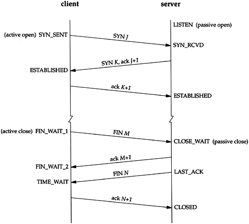
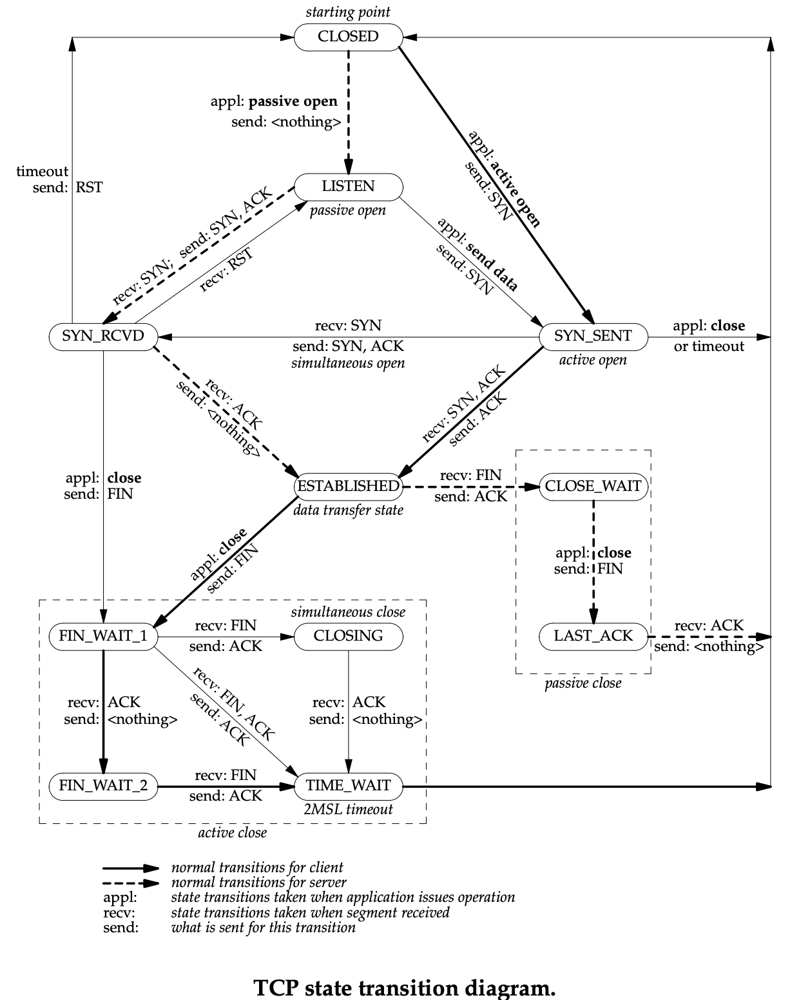

## TCP
### TCP 报文段格式

```
 0                   1                   2                   3
 0 1 2 3 4 5 6 7 8 9 0 1 2 3 4 5 6 7 8 9 0 1 2 3 4 5 6 7 8 9 0 1
+-+-+-+-+-+-+-+-+-+-+-+-+-+-+-+-+-+-+-+-+-+-+-+-+-+-+-+-+-+-+-+-+
|          Source Port          |       Destination Port        |
+-+-+-+-+-+-+-+-+-+-+-+-+-+-+-+-+-+-+-+-+-+-+-+-+-+-+-+-+-+-+-+-+
|                        Sequence Number                        |
+-+-+-+-+-+-+-+-+-+-+-+-+-+-+-+-+-+-+-+-+-+-+-+-+-+-+-+-+-+-+-+-+
|                    Acknowledgment Number                      |
+-+-+-+-+-+-+-+-+-+-+-+-+-+-+-+-+-+-+-+-+-+-+-+-+-+-+-+-+-+-+-+-+
| Offset|    Res.   |   Flags   |             Window            |
+-+-+-+-+-+-+-+-+-+-+-+-+-+-+-+-+-+-+-+-+-+-+-+-+-+-+-+-+-+-+-+-+
|           Checksum            |         Urgent Pointer        |
+-+-+-+-+-+-+-+-+-+-+-+-+-+-+-+-+-+-+-+-+-+-+-+-+-+-+-+-+-+-+-+-+
|                    Options                    |    Padding    |
+-+-+-+-+-+-+-+-+-+-+-+-+-+-+-+-+-+-+-+-+-+-+-+-+-+-+-+-+-+-+-+-+
|                                                               |
|                             data                              |
|                                                               |
```

Sequence Number： 序号建立在字节流上，而不是报文段上。值为本报文段发送数据的第一个字节的序号。
Acknowledgment Number： 确认号是期望收到对方的下一个报文段数据的第一个字节的序号。


### 连接建立
客户端欲与服务端建立连接，客户端首先发起一个连接。由于可能请求包会丢失，可能请求包在链路上传输时间过长而超时，也可能服务端拒绝建立连接，因此客户端会不断发出请求包，直到达到一定次数再放弃，建立连接失败。

服务端收到请求包后，且同意建立连接，就会发送应答包。由于可能应答包会丢失，可能应答包在链路上传输时间过长而超时，也可能客户端出现异常无法继续建立连接，因此服务端会不断发出应答包，直到达到一定次数再放弃，建立连接失败。

服务端发送的应答可能会发送多次，但是只要一次到达客户端，客户端就认为连接已经建立了，因为对于客户端来讲，客户端的消息有去有回，客户端的单工通信正常工作。

客户端会给服务端发送应答之应答，而服务端收到这个消息后，服务端确认连接的建立，因为对于服务端来讲，服务端的消息有去有回，服务端的单工通信正常工作。

至此，双工通信连接建立完成。

三次握手还可以避免客户端发出的多个请求包有一些可能因为时延，过了很久才到达服务端，而服务端会将其当成一个正常的请求。

第三次握手也可能丢包，超时，可能客户端异常。事实上再多次握手都不能完全保证可靠，只需要双方消息都有去有回即可。大部分情况下，建立连接后，客户端会立刻发送数据。如果第三次握手的应答并没有到达服务端，服务端在收到客户端发送的数据后，就会认为连接已经建立。又或者服务端异常，客户端的数据会报错，表明服务端不可达，此时客户端会得知连接断开了。

连接建立后，没有数据流通情况下，可以定时发送探活包，服务端也可以主动关闭长时间没有数据流通的连接。


### 确认序号
三次握手除了建立连接外，还是确立了 TCP 包的序号。第一次握手，客户端告诉服务端它发出的包开始的序号。第二次握手，服务端告诉客户端它发出的包开始的序号。

每个连接都需要重新确立序号，这样可以避免先后不同连接之间序号可能发生的冲突。起始序号随着时间变化，可以看作 32 位的计数器，每 4ms 加一，重复的序号需要 4 个多小时，在此期间延时的数据包的 TTL 早已耗尽。


### 断开连接



TCP 是双工通信，建立连接需要双向确认，断开连接同样需要双向确认。

首先由客户端主动发起断开连接的请求，客户端进入 FIN_WAIT_1 状态，服务端收到消息后，发送一个 ACK 消息，并进入 CLOSE_WAIT 状态。客户端收到 ACK 后进入 FIN_WAIT_2 状态，如果此时服务端相应的程序直接停止占用该端口，则客户端将永远保持这个状态。TCP 协议中没有对这个状态的处理，但是 Linux 有一个 tcp_fin_timeout 参数，可以设置一个超时时间。

此时，服务端可能还有数据没发送完，双工通信只关闭了单个方向，处于半关闭的状态。服务端发送完数据后，也发了一个断开连接的 FIN 消息，服务端进入 LAST_ACK 状态。客户端收到消息后，发送一个 ACK 并进入 TIME_WAIT 状态，等待一段时间没有收到服务端的消息后，就会进入 CLOSED 状态。服务端收到客户端回复的 ACK 后也会进入 CLOSED 状态。

客户端处于 TIME_WAIT 状态有两个好处。一是如果客户端的 ACK 被丢弃或超时，没有在一定时间内到达服务端，服务端会重新发出 FIN 消息，客户端收到后会再次发送 ACK；另一个是如果客户端的程序停止占用该端口，有另一个新的程序开始占用该端口，而服务端之前发的一些延时较高的包还在传输中，这个新的程序会收到上个连接中服务端发过来的包，虽然序列号是重新生成的，但是为了更好地防止产生混乱，等待足够长的时间，等到原来服务端发送的所有的包 TTL 都耗尽了，再空出端口。

TIME_WAIT 等待时间一般为 2MSL（Maximum Segment Lifetime），协议规定 MSL 为 2 分钟，实际应用中常用的是 30 秒，1 分钟和 2 分钟等。

也有可能服务端超过 2MSL 时间还未收到 ACK，这时服务端重发 FIN 消息到客户端，客户端收到后会发送 RST 消息告知异常断开连接，直接释放相关资源。




### TCP 特性
为了记录所有发送的包和接收的包，TCP 需要发送端和接收端都有缓存来保存这些记录。

发送端缓存里包情况分为四类：发送了且已经确认的；发送了且尚未确认的；没有发送且等待发送的；没有发送且暂时不会发送的。

接收端缓存里记录的内容分为三类：接受且确认过的；没接收但马上就能接收的；没接收也没法接收的。

#### 顺序问题与丢包问题
TCP 并不是把应用层传输过来的数据直接加上首部然后发送给目标，而是把数据看成一个字节流，给他们标上序号之后分部分发送。这就是 TCP 的面向字节流特性。面向字节流不代表是一个字节一个字节地发送，而是一次截取一整段。截取的长度受多种因素影响，如缓存区的数据大小、数据链路层限制的帧大小等。

TCP 为了保证顺序性，每一个包都有序号。收到的包可能不是顺序的，会出现空挡，只有序号紧接着接受且确认过的包，可以马上进行回复，中间空着的部分需要等待，即使接收到后面的包。

为了提高网络效率，TCP 采用累积确认机制。接收端不需要逐个进行回复，而是累积到一定量的数据包之后，告诉发送方，在此数据包之前的数据全都收到。

发送端缓存区会继续存储已发送但未收到确认的报文段，以便在需要时重传。TCP 重传策略有多种，例如超时重传、快速重传、选择确认等。

超时重传就是发送端发出一个数据包后开始计时，如果超过一定时间没有收到 ACK，就会再次发送这个数据包。接收端如果收到之前延时较高的数据包和超时重传的数据包，根据数据字节编号可以得知两个数据包内容相同。超时重传的时间是不断变化的，通过采样 RTT 的时间和波动范围计算出一个估计的超时时间，这被称为自适应重传算法。

快速重传是当接收端收到一个序号大于下一个所期望的报文段时，就发送三个冗余的 ACK，确认号为已确认的最大序号报文段的下一个报文段的序号，发送端收到后，就会重传丢失的报文段。

选择重传就是在选项字段中加上 SACK 信息，告知已收到的报文段，确认缺失报文段的边界。


#### 流量控制
考虑接收端缓冲区以及读取数据的能力。如果发送太快导致接收端无法接受，那么只是会频繁进行重传，浪费了网络资源。

在 TCP 里，接收端在对于包的确认中，同时会携带一个窗口的大小，叫 Advertised window。发送端需要根据接收端的缓冲区大小，设置自己的可发送窗口大小，处于窗口内的数据表示可发送，之外的数据不可发送。当窗口内的数据接收到确认回复时，整个窗口会往前移动，直到发送完成所有的数据。


#### 拥塞控制
拥塞控制主要考虑的是避免网络过分拥挤导致丢包严重，网络效率降低。


TCP 提供可靠交付。通过 TCP 连接传输的数据，无差错、不丢失、不重复、并且按序到达。


[图解网络｜收到RST，就一定会断开TCP连接吗？](https://mp.weixin.qq.com/s/8AGdziLX7Pl7x7iwpPd_yg)

[Wireshark-TCP协议分析（包结构以及连接的建立和释放）_三哥的博客-CSDN博客](https://blog.csdn.net/ahafg/article/details/51039584)


### 参考
1. 《趣谈网络协议》 - 刘超