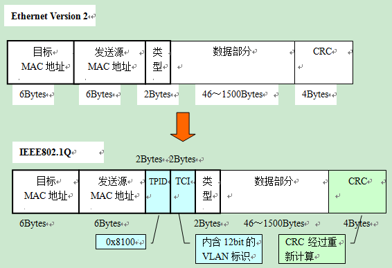
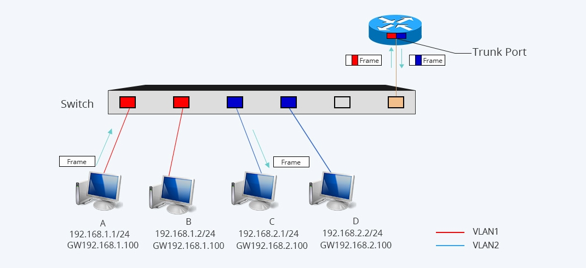

## VLAN
VLAN （Virtual LAN），虚拟局域网。这里的 LAN 指的是路由器分隔的网络，也就是广播域。

### 背景
本来，二层交换机只能构建单一的广播域，可能会影响到网络整体的传输性能。广播帧会传播到网络上的每一台主机，对每一台计算机的 CPU 造成负担，同时广播信息也消耗了网络整体的带宽。广播帧会非常频繁地出现。利用 TCP/IP 协议栈通信时，除了 ARP 外，还有可能需要发出 DHCP、RIP 等很多其他类型的广播信息。RIP 以外的其他路由协议使用多播传输路由信息，这也会被交换机转发（Flooding）。除了 TCP/IP 以外，NetBEUI、IPX 和 Apple Talk 等协议也经常需要用到广播。

分割广播域时，一般都必须使用到路由器。使用路由器后，可以以路由器上的网络接口（LAN Interface）为单位分割广播域。通常情况下路由器上不会有太多的网络接口，其数目多在1～4个左右。（无线路由器上的 LAN 接口实际上是路由器内置的交换机，并不能分割广播域。）

与路由器相比，二层交换机一般带有多个网络接口。如果能使用它来分割广播域，可以大大提高灵活性。用于在二层交换机上分割广播域的技术，就是 VLAN。通过利用 VLAN，我们可以自由设计广播域的构成，提高网络设计的自由度。

### 实现机制
在一台未设置任何 VLAN 的二层交换机上，任何广播帧都会被转发给除接收端口外的所有其他端口（Flooding）。

VLAN 通过限制广播帧转发的范围分割了广播域，一个端口来的数据包不转发给除接收端口外的所有端口，而只是部分端口。更为直观地描述 VLAN，**可以把它理解为将一台交换机在逻辑上分割成了数台交换机。**VLAN 生成的逻辑上的交换机是互不相通的。因此，在交换机上设置 VLAN 后，如果未做其他处理，VLAN 间是无法通信的。

通常两个广播域之间由路由器连接，广播域之间来往的数据包都是由路由器中继的。因此，VLAN 间的通信也需要路由器提供中继服务，这被称作「VLAN 间路由」。VLAN 间路由，可以使用普通的路由器，也可以使用三层交换机。

交换机的端口，可以分为以下两种：
1. 访问链接 （Access Link）
2. 汇聚链接 （Trunk Link）

#### 访问链接 Access Link
访问链接，指的是只属于一个 VLAN，且仅向该 VLAN 转发数据帧的端口。在大多数情况下，访问链接所连的是客户机。

设定访问链接，可以是事先固定的静态 VLAN，也可以是根据所连的计算机而动态改变设定的动态 VLAN。

静态 VLAN 又被称为基于端口的 VLAN，明确指定各端口属于哪个 VLAN。客户机每次变更所连端口，都必须同时更改该端口所属 VLAN 的设定，不适合那些需要频繁改变拓补结构的网络。

动态 VLAN 则是根据每个端口所连的计算机，随时改变端口所属的 VLAN。动态 VLAN 可以大致分为 3 类：基于 MAC 地址的 VLAN（二层）、基于子网的 VLAN（三层）、基于用户的 VLAN（四层以上）。

跨越多台交换机设置 VLAN 需要在交换机上为 VLAN 预留访问链接，链路两端端口属于同一个 VLAN。这个方案扩展性很差，因此引入了汇聚链接。

#### 汇聚链接 Trunk Link
汇聚链接（Trunk Link）指的是能够转发多个不同 VLAN 的通信的端口。汇聚链路上流通的数据帧，都被附加了用于识别分属于哪个 VLAN 的特殊信息。数据帧通过 Trunk 时被加上 VLAN 识别信息，进入另一端的 Trunk 口时，去除 VLAN 标识，恢复成原始的数据帧。**只有在汇聚链路上的数据帧才有 VLAN 标识**。

汇聚链路可以被看作属于所有的VLAN。

通过汇聚链接，可以很方便地跨越多台交换机设置 VLAN，只需用交叉线将不同交换机的 Trunk 口连接起来。

#### IEEE 802.1Q VLAN 帧格式
以太网数据帧的标准格式 与 IEEE 802.1Q VLAN 帧格式

IEEE 802.1Q 所附加的 VLAN 识别信息，位于数据帧中发送源 MAC 地址与类别域（Type Field）之间。2 字节的 TPID（Tag Protocol IDentifier）和 2 字节的 TCI（Tag Control Information），共计4字节。

TPID 字段在以太网报文中所处位置与不带 VLAN Tag 的报文中协议类型字段所处位置相同。TPID 的值固定为 0x8100，它标示网络帧承载的 802.1Q 类型，交换机通过它来确定数据帧内附加了基于 IEEE 802.1Q 的 VLAN 信息。而实质上的 VLAN ID，是 TCI 中的 12 位元，最多可供识别 4096 个 VLAN。

在数据帧中插入 TPID、TCI 后，会对包括它们在内的整个数据帧重新计算 CRC。当数据帧离开汇聚链路时，TPID 和 TCI 会被去除，这时还会进行一次 CRC 的重新计算。

### 路由
VLAN 划分了多个广播域，广播域之间不通过路由就没法通信。路由功能，一般主要由路由器提供。如今，也经常利用带有路由功能的交换机——三层交换机（Layer 3 Switch）来实现。

通过访问链接连接路由器和交换机，扩展性很差。交换机必须给每一个 VLAN 预留端口。使用汇聚链接，则只需要一个 Trunk 口。路由器上的端口需要支持汇聚链路。双方用于汇聚链路的协议也必须相同。

接着在路由器上定义对应各个 VLAN 的「子接口」（Sub Interface）。尽管实际与交换机连接的物理端口只有一个，但在理论上我们可以把它分割为多个虚拟端口。

VLAN 将交换机从逻辑上分割成了多台，形成多个广播域，因而用于 VLAN 间路由的路由器，也必须拥有对应各个 VLAN 的虚拟接口。新建 VLAN，只需要在路由器上新设一个对应新 VLAN 的子接口即可。某一 VLAN 中的计算机的网关设置为对应于此 VLAN 的路由器子接口的 IP 地址。

同一 VLAN 内通信在交换机内部完成。不同 VLAN 通信在路由器的帮助下进行。从一个 VLAN 发往另一个 VLAN 的数据帧目标 MAC 地址为网关 MAC 地址，即路由器端口 MAC 地址。数据帧到达路由器后，路由器将目标 MAC 地址改为目标计算机的 MAC 地址，并**负责修改 VLAN 标识**，然后从目标 VLAN 对应的子接口将数据帧发送出去。

传输过程中，源 IP 和 目标 IP 保持不变。

### 三层交换机
交换机使用被称为 ASIC（ApplicationSpecified Integrated Circuit）的专用硬件芯片来处理数据帧的交换操作，在很多机型上都能实现以缆线速度（Wired Speed）交换。而路由器，则基本上是基于软件处理的。即使以缆线速度接收到数据包，也无法在不限速的条件下转发出去，因此汇聚链路部分会成为 VLAN 间路由网络速度的瓶颈。

三层交换机就是为了解决上述问题而诞生的。三层交换机，本质上就是带有路由功能的（二层）交换机。三层交换机内部的路由模块和交换模块之间由汇聚链路连接。内置的路由模块与交换模块相同，使用 ASIC 硬件处理路由，与传统的路由器相比，可以实现高速路由。由于是内部连接，可以确保相当大的带宽。

对于流（一连串数据），会将第一次路由结果保存在缓存中，后续不再通过路由模块，对数据帧采取与之前相同的操作，达到加速的效果。

## 参考
1. [VLAN原理详解_曾梦想仗剑走天涯-CSDN博客_vlan](https://blog.csdn.net/phunxm/article/details/9498829)