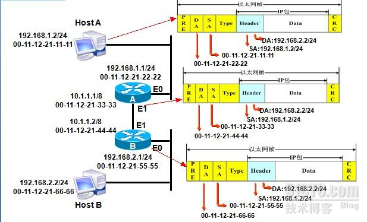

## 网络层
### 网关 Gateway
- 比如有网络 A 和网络 B，网络 A 的 IP 地址范围为 192.168.1.1-192.168.1.254，子网掩码为 255.255.255.0；网络 B 的 IP 地址范围为 192.168.2.1-192.168.2.254，子网掩码为 255.255.255.0。在没有路由器的情况下，两个网络之间是不能进行 TCP/IP 通信的，即使是两个网络连接在同一台交换机（或集线器）上，TCP/IP 协议也会根据子网掩码（255.255.255.0）判定两个网络中的主机处在不同的网络里。而要实现这两个网络之间的通信，则必须通过网关。
- 现在，路由器集成了网关的功能，所以路由器也具有网关的功能。
- 如果只是简单地连接两个网络，只使用网关将这两个网络连接即可，因为只有两个网络，不需要决定网络间最短路径。

- 如果需要连接多个网络，为了保证网络的可靠性，网络结构需要设计为全网状或部分网状，这样，为了网络间的通信，需要网关和路由器两种设备，因为当前路由器集成了网关的功能，所以只使用路由器一种设备就可以了。

### 路由器 Router
- 路由器负责不同网络之间的通信。在路由器中有一张路由表，记录着到不同网段的信息。路由表中的信息分为直连路由和非直连路由。
  - 直连路由：是直接连接在路由器接口的网段，由路由器自动生成。
  - 非直连路由：就是不是直接连接在路由器接口上的网段，此记录需要手动添加或者是使用动态路由。
- 路由表中记录的条目有的需要手动添加(称为静态路由)，有的测试动态获取的(称为动态路由)。直连路由属于静态路由。
- 路由器是工作在网络层的，在网络层可以识别逻辑地址。当路由器的某个接口收到一个包时，路由器会读取包中相应的目标的逻辑地址的网络部分，然后在路由表中进行查找。如果在路由表中找到目标地址的路由条目，则把包转发到路由器的相应接口，如果在路由表中没有找到目标地址的路由条目，那么，如果路由配置默认路由，就按默认路由的配置转发到路由器的相应接口；如果没有配置默认路由，则将该包丢弃，并返回不可到达的信息。
- 路由表通过 RIP 协议建立，表项大概有：目的地址，下一跳地址，接口等等

1. HostA 在网络层将来自上层的报文封装成 IP 数据包，其中源 IP 地址为自己，目标 IP 地址是 HostB， HostA 会用本机配置的 24 位子网掩码与目标地址进行“与”运算，得出目标地址与本机不是同一网段，因此发送 HostB 的数据包需要经过网关路由 A 的转发。
2. HostA 通过 ARP 请求获取网关路由 A 的 E0 口的 MAC 地址，并在链路层将路由器 E0 接口的 MAC 地址封装成目标 MAC 地址，源 MAC 地址是自己。
3. 路由器 A 从 E0 可接收到数据帧，把数据链路层的封装去掉，并检查路由表中是否有目标 IP 地址网段(即192.168.2.2的网段)相匹配的的项，根据路由表中记录到 192.168.2.0 网段的数据请发送给下一跳地址 10.1.1.2，因此数据在路由器A的 E1 口重新封装，此时，源 MAC 地址是路由器 A 的 E1 接口的 MAC 地址，封装的目标 MAC 地址则是路由器2的 E1 接口的 MAC 地址。
4. 路由 B 从 E1 口接收到数据帧，同样会把数据链路层的封装去掉，对目标 IP 地址进行检测，并与路由表进行匹配，此时发现目标地址的网段正好是自己 E0 口的直连网段，路由器 B 通过 ARP 广播，获知 HostB 的 MAC 地址，此时数据包在路由器 B 的 E0 接口再次封装，源 MAC 地址是路由器 B 的 E0 接口的 MAC 地址，目标 MAC 地址是 HostB 的 MAC 地址。封装完成后直接从路由器的 E0 接口发送给 HostB。
5. 此时 HostB 才会收到来自 HostA 发送的数据。