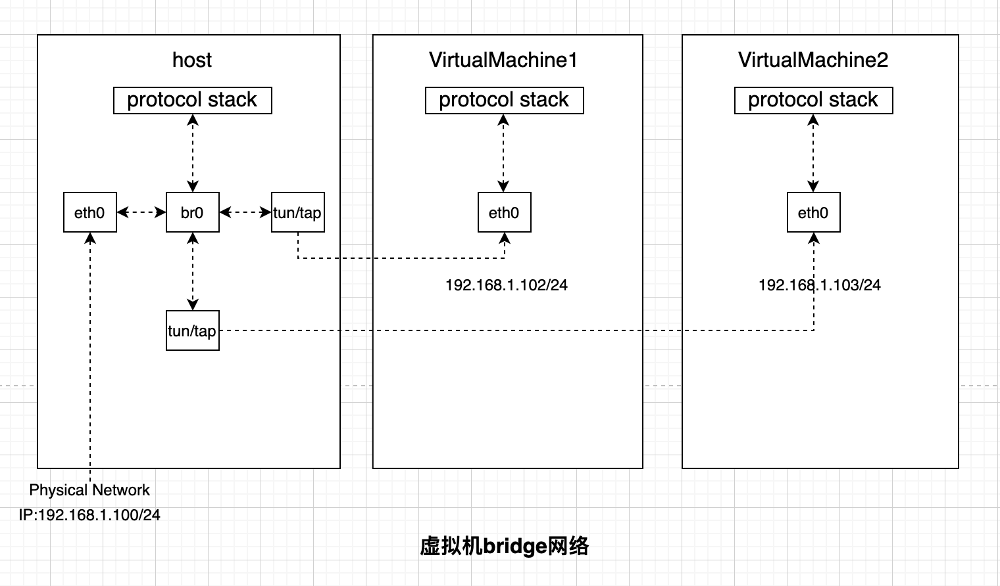
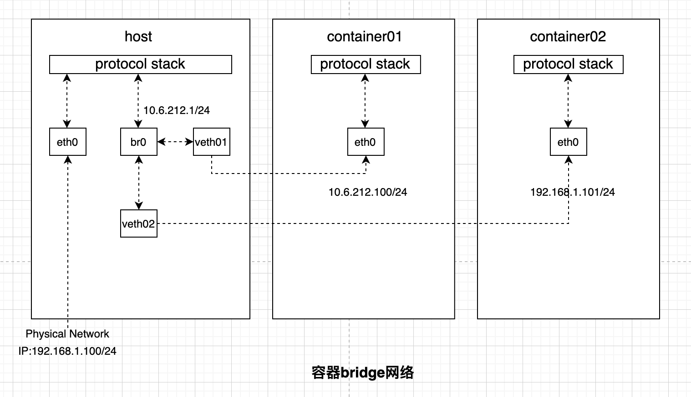

`bridge`是linux虚拟化网络设备，可以理解为用软件实现的交换机，他具有物理交换机的一起工作：二层网络交换和MAC地址学习。下面是他在虚拟机和容器网络中运用，存在一些不同：

* 虚拟机bridge网络模型：

  

br0就是虚拟的出来的bridge，可以当成交换机。tun/tap也是一种linux虚拟网络设备（此时先当成黑盒，看成网线的两端），一端连接br0，一端连接其他主机，
将物理的网卡也连接到br0上，所有的通讯都通过br0跟协议栈交互，效率很高。此时所有的主机跟物理网卡一样处于同层网络（他们的网关必须一样，路由器的ip地址）。

* 容器bridge网络模型：
  

容器bridge网络模型和虚拟机的bridge网络模型有很大的同，个人认为更像是虚拟机的NAT模式，veth-pair也是linux虚拟网络设备（也看成黑盒，设备两端的数据会同步更新），他们总是成对
出现，一端连接容器，一端连接br0。br0更像是交换机加上路由器（容器的网关就是br0的地址），整个容器网络就是一个VLAN。容器之间通过交换机（MAC地址）进行通信，容器如果要访问外网则
需要br0使用nat进行地址转化。docker的网络模式默认就是使用bridge，br0就是经常看到的docker01的虚拟网络设备。
## Linux 网桥
- Linux 支持多个不同的网络，可以用网桥使它们之间能够相互通信。网桥是一个二层的虚拟网络设备， 把若干个网络接口“连接” 起来，以使得网络接口之间的报文能够相互转发。网桥能够解析收发的报文，读取目标 MAC 地址的信息，将其与自己记录的 MAC 表结合，来决策报文的转发目标网络接口。为了实现这些功能，网桥会学习源 MAC 地址(二层网桥转发的依据就是 MAC 地址)。在转发报文时，网桥只需向特定的网口进行转发，来避免不必要的网络交互。如果它遇到一个自己从未学习到的地址，就无法知道这个报文应该向哪个网络接口转发，将报文广播给所有的网络接口(报文来源的网络接口除外)。在实际的网络中，网络拓扑不可能永久不变。设备如果被移动到另一个端口上，却没有发送任何数据，网桥设备就无法感知这个变化，网桥还是向原来的端口转发数据包，在这种情况下数据会丢失。所以网桥还要对学习到的 MAC 地址表加上超时时间（默认为 5 min）。如果网桥收到了对应端口 MAC 地址回发的包，则重置超时间，否则过了超时时间，就认为设备已经不在那个端口上了，它会重新广播发送。
- Linux 主机过去一般只有一个网卡，现在多网卡的机器越来越多，而且有很多虚拟设备存在，所以 Linux 网桥提供了在这些设备之间相互转发数据的二层设备。
- Linux 内核支持网口的桥接(目前只支持以太网接口)。但是与单纯的交换机不同，交换机只是一个二层设备，对于接收到的报文，要么转发，要么丢弃。运行着 Linux 内核的机器本身就是一台主机，有可能是网络报文的目的地，其收到的报文除了转发和丢弃，还可能被送到网络协议栈的上层(网络层), 从而被自己(这台主机本身的协议栈)消化，所以既可以把网桥看作一个二层设备，也可以把它看作一个三层设备。
- 实现：通过虚拟设备绑定若干个以太网接口设备。与普通设备不同，Linux 网桥还可以有一个 IP 地址。
- Linux 网桥和现实世界中的二层交换机有一个区别，数据被直接发到 Bridge 上，而不是从一个端口接受。这种情况可以看做 Bridge 自己有一个 MAC 可以主动发送报文，或者说 Bridge 自带了一个隐藏端口和寄主 Linux 系统自动连接，Linux 上的程序可以直接从这个端口向 Bridge 上的其他端口发数据。所以当一个 Bridge 拥有一个网络设备时，如 bridge0 加入了 eth0 时，实际上 bridge0 拥有两个有效 MAC 地址，一个是 bridge0 的，一个是 eth0 的，他们之间可以通讯。由此带来一个有意思的事情是，Bridge 可以设置 IP 地址。通常来说 IP 地址是三层协议的内容，不应该出现在二层设备 Bridge 上。但是 Linux 里 Bridge 是通用网络设备抽象的一种，只要是网络设备就能够设定 IP 地址。当一个 bridge0 拥有 IP 后，Linux 便可以通过路由表或者 IP 表规则在三层定位 bridge0，此时相当于 Linux 拥有了另外一个隐藏的虚拟网卡和 Bridge 的隐藏端口相连，这个网卡就是名为 bridge0 的通用网络设备，IP 可以看成是这个网卡的。当有符合此 IP 的数据到达 bridge0 时，内核协议栈认为收到了一包目标为本机的数据，此时应用程序可以通过 Socket 接收到它。一个更好的对比例子是现实世界中的带路由的交换机设备，它也拥有一个隐藏的 MAC 地址，供设备中的三层协议处理程序和管理程序使用。设备里的三层协议处理程序，对应名为 bridge0 的通用网络设备的三层协议处理程序，即寄主 Linux 系统内核协议栈程序。设备里的管理程序，对应 bridge0 寄主 Linux 系统里的应用程序。
- Linux 网桥的实现有一个限制：当一个设备被 attach 到 Bridge 上时，那个设备的 IP 会变的无效，Linux 不再使用那个 IP 在三层接受数据。举例如下：如果 eth0 本来的 IP 是 192.168.1.2，此时如果收到一个目标地址是 192.168.1.2 的数据，Linux 的应用程序能通过 Socket 操作接受到它。而当 eth0 被 attach 到一个 bridge0 时，尽管 eth0 的 IP 还在，但应用程序是无法接受到上述数据的。此时应该把 IP 192.168.1.2 赋予 bridge0。
- 另外需要注意的是数据流的方向。对于一个被 attach 到 Bridge 上的设备来说，只有它收到数据时，此包数据才会被转发到 Bridge 上，进而完成查表广播等后续操作。当请求是发送类型时，数据是不会被转发到 Bridge 上的，它会寻找下一个发送出口。用户在配置网络时经常忽略这一点从而造成网络故障。
