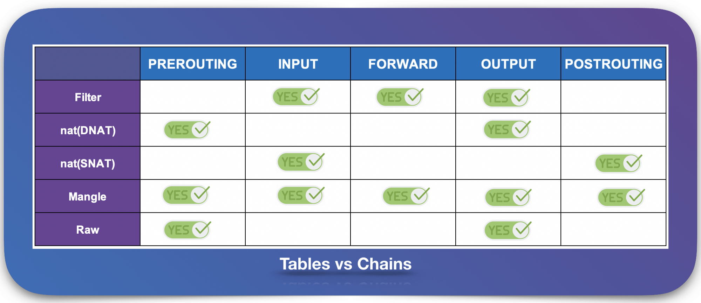

## iptables
iptables 是一种 Linux 内核功能，旨在成为一种高效的防火墙，具有足够的灵活性来处理各种常见的数据包操作和过滤需求。它允许将灵活的规则序列附加到内核的数据包处理管道中的各种钩子上。通过 iptables 的一系列规则可以实现虚拟网络的流量转发。

在 iptables 模式下，kube-proxy 将规则附加到 PREROUTING chain 上，以实现 NAT 和负载均衡功能。

### 基本概念
iptables 其实不是真正的防火墙，可以将它看作 client，用户通过 iptables 将规则应用到真正的防火墙 netfilter。iptables 位于用户空间，我们用这个工具操作真正的防火墙，位于内核空间的 netfilter。

netfilter 工作在二层和三层，上接四层 socket。netfilter 提供一系列内核之内的钩子 hook。二层、三层对应 ebtables 和 iptables。

iptables 有一系列表 (tables)，每个表有一些链 (chains)，每个链有一些规则 (rules)。链其实就是内核中的 hook point。每个经过 hook point 的报文，都要将这条链上的所有规则匹配一遍，如果有符合条件的规则，则执行规则对应的动作。动作称为 target。没有被任何规则匹配到时，会默认放行报文。

实际上讨论 iptables 按照 链 - 表 - 规则 的顺序，这与上述顺序不一致。iptables 引入表，一方面可以方便管理规则，另一方面可以确保规则按指定顺序执行。

iptables 有一些预设的表和预设的链。在一个链（hook point）上，表执行顺序为：raw, mangle, nat, filter。

预设的链：
- PREROUTING: 在路由前修改数据包，例如 DNAT
- INPUT: 要发往主机的数据包
- FORWARD: 不是发往主机的数据包，也不是主机产生的数据包，只是从主机经过
- OUTPUT: 从主机产生的数据包
- POSTROUTING: 路由之后，数据包要离开主机，进行 SNAT

预设的表：
- raw: 是否启用连接追踪
- mangle: 修改数据包的头信息
- nat: 地址转换
- filter: 起到过滤功能

================================================

conntrack

nat 只有第一次使用

- Netfilter hooks in more detail: IPv4, IPv6, ARP, Bridging, network namespaces and Ingress. IPv4, IPv6 数据包走各自的 hook

- 可以在某个表里面创建自定义链，将针对某个应用程序所设置的规则放置在这个自定义链中，但是自定义链接不能直接使用，只能被某个默认的链当做动作去调用才能起作用
- Iptables chains registered with IPv4 Netfilter hooks (+conntrack)

- priority order: raw, mangle, conntrack, dstnat, filter, security, srcnat

- Docker 安装了两个 iptables chains，`DOCKER-USER`、`DOCKER`，数据包总是先走这两个 chain，`DOCKER-USER` 在 `DOCKER` 之前，因为 nat PREROUTING 第一条是 `-A PREROUTING -m addrtype --dst-type LOCAL -j DOCKER`
- `iptables-save` 查看 Docker 添加的一些 iptables rules
  1. NAT 表 `-A PREROUTING -m addrtype --dst-type LOCAL -j DOCKER` 和 `-A OUTPUT ! -d 127.0.0.0/8 -m addrtype --dst-type LOCAL -j DOCKER` 匹配生效后，都会继续执行 DOCKER 链，而此时 DOCKER 链为空，所以前两条只是做了一个框架，并没有实际效果。
  2. NAT 表 `-A POSTROUTING -s 172.17.0.0/16 ! -o docker0 -j MASQUERADE` 表示如果本地发出的数据包不是前往 docker0，而是发往主机之外的设备的，需要进行动态地址修改（MASQUERADE），将源地址从容器的地址（172段）修改为宿主机网卡的 IP 地址，之后再发送给外面的网络。
  3. FILTER 表 `-A FORWARD -o docker0 -j DOCKER` 也是一个框架，因为后续的 DOCKER 链为空。
  4. FILTER 表 `-A FORWARD -i docker0 ! -o docker0 -j ACCEPT` docker0 发出的包，如果需要转发到非 docker0 本地 IP 地址的设备， 则是允许的。这样，docker0 设备的包就可以根据路由规则中转到宿主机的网卡设备，从而访问外面的网络了。
  5. FILTER 表 `-A FORWARD -i docker0 -o docker0 -j ACCEPT` docker0 的包还可以被中转给 docker0 本身，即连接在 docker0 网桥上的不同容器之间的通信也是允许的。
  6. FILTER表 `-A FORWARD -o docker0 -m conntrack --ctstate RELATED,ESTABLISHED -j ACCEPT` 如果接收到的数据包属于以前已经建立好的连接，那么允许直接通过。这样，接收到的数据包自然又走回 docker0, 并中转到相应的容器。
- 除了这些 Netfilter 的设置，Linux 的 ip_forward 功能也被 Docker Daemon 打开了: `cat /proc/sys/net/ipv4/ip_ forward`
- 启动一个进行了端口映射的容器，`0.0.0.0:8080->8080/tcp, :::8080->8080/tcp`，iptables 有了新的规则：
  1. FILTER 表 `-A DOCKER -d 172.17.0.2/32 ! -i docker0 -o docker0 -p tcp -m tcp --dport 8080 -j ACCEPT`
  2. NAT 表 `-A POSTROUTING -s 172.17.0.2/32 -d 172.17.0.2/32 -p tcp -m tcp --dport 8080 -j MASQUERADE`
  3. NAT 表 `-A DOCKER ! -i docker0 -p tcp -m tcp --dport 8080 -j DNAT --to-destination 172.17.0.2:8080`

### 实例
- 集群外部访问宿主机 8080：
  1. 首先匹配到 NAT `-A PREROUTING -m addrtype --dst-type LOCAL -j DOCKER`，跳转到 DOCKER 链
  2. 然后 DOCKER `-A DOCKER ! -i docker0 -p tcp -m tcp --dport 8080 -j DNAT --to-destination 172.17.0.2:8080` 地址转换到 172.17.0.2:8080
  3. 然后 FORWARD `-A FORWARD -j DOCKER-USER`，跳转到 DOCKER-USER 链，我们可以在 DOCKER-USER 定义自己的规则 （前文所说数据包总是先走这两个 chain，且 `DOCKER-USER` 在 `DOCKER` 之前就是这个意思）
  4. 然后 DOCKER-USER `-A DOCKER-USER -j RETURN` 返回 FORWARD
  5. 然后 FORWARD 走完 到 POSTROUTING
  6. 然后 POSTROUTING 默认可以通过
  7. 然后就通过 docker0 转发数据包